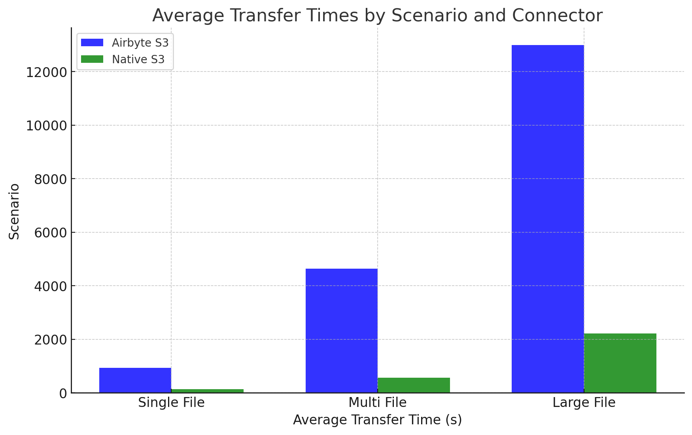
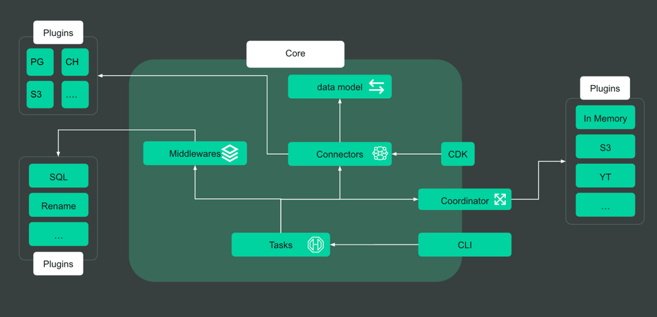
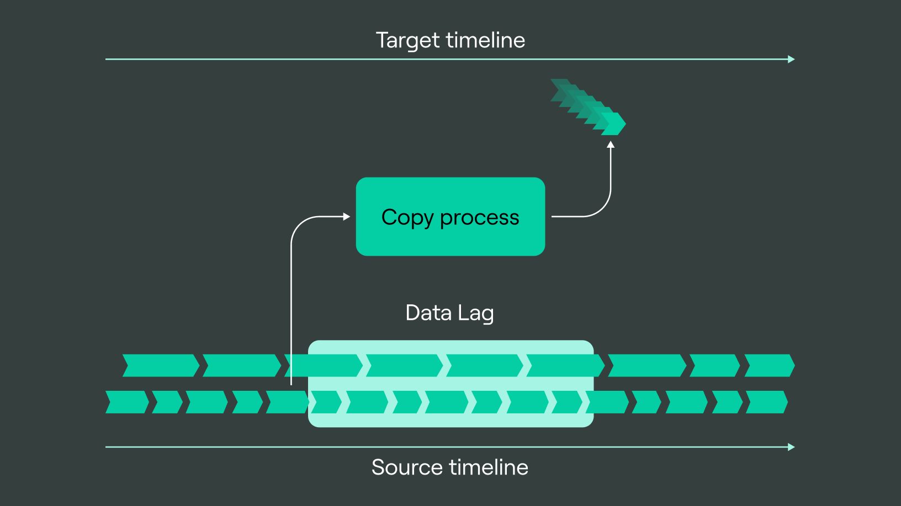
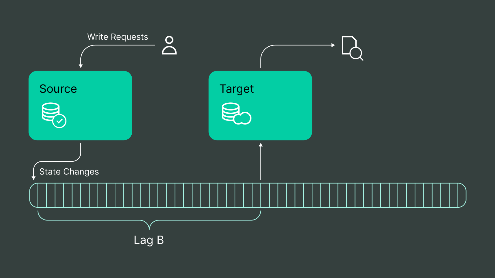

<h1 align="center">Transfer: Cloud Native Ingestion engine</h1>

<div align="center">

<h4 align="center">
  <a href="https://doublecloud.github.io/transfer/">Transfer</a>  |
  <a href="https://doublecloud.github.io/transfer/docs/getting_started.html">Documentation</a>  |
  <a href="https://doublecloud.github.io/transfer/docs/benchmarks.html">Benchmarking</a>  |
  <a href="https://doublecloud.github.io/transfer/docs/roadmap">Roadmap</a>
</h4>


</div>

<div align="center">

## 🦫 Introduction

</div>

**Transfer**, built in Go, is an open-source cloud native ingestion engine. Essentially we are building no-code (or low-code) EL(T) service that can scale data pipelines from several megabytes of data to dozens of petabytes without hassle.

Transfer provides a convenient way to transfer data between DBMSes, object stores, message brokers or anything that stores data.
Our ultimate mission is to help you move data from any source to any destination with fast, effective and easy-to-use tool.

<div align="center">


## 🚀 Try Transfer

</div>

### 1. Using CLI

Build from souces:

```shell
make build
```


### 2. Using docker container

```shell
docker pull ghcr.io/doublecloud/transfer:dev
```

### 3. Deploy via helm-chart

We strongly believe in cloud-native technologies, and see **transfer** as a driven power for open-source data-platforms build on top of clouds.

Deploy as helm-chart in your own k8s cluster

```bash
helm upgrade NAME_OF_TRANSFER \
  --namespace NAME_OF_NAMESPACE oci://ghcr.io/doublecloud/transfer-helm/transfer \
  --values PATH_TO_VALUES_FILE \
  --install
```

More details [here](./docs/deploy_k8s.md). 

<div align="center">

## 🚀 Getting Started

</div>


<details>
<summary>Ingestion from OLTP</summary>

- [Replication MySQL Changes into Clickhouse](./examples/mysql2ch)
- [Snapshot PostgreSQL Changes into Clickhouse](./examples/pg2ch)
- [Replication MongoDB into Clickhouse with transformation](./docs/mongodb2ch)
- [CDC From Postgres into YTSaurus](./examples/pg2yt)

</details>

<details>
<summary>Streaming Ingestion</summary>

- [Kafka to Clickhouse](./examples/kafka2ch)
- [Re-Map Kafka source to other Kafka Target](./examples/kafka2kafka)

</details>

<details>
<summary>CDC Streaming into Kafka</summary>

- [MySQL CDC into Kafka](./examples/mysql2kafka)

</details>

<details>
<summary>Semi-structured Ingestion</summary>

- [S3 with SQS ingestion to Clickhouse](./examples/s3sqs2ch/README.md)

[//]: # (- [Parquet file to Clickhouse]&#40;./examples/s32ch/parquet.md&#41;)
[//]: # (- [CSV file to Clickhouse]&#40;./examples/s32ch/csv.md&#41;)

</details>

<details>
<summary>Airbyte compatibility</summary>

- [Airbyte source](./examples/airbyte_adapter)

</details>

<details>
<summary>Transformers</summary>

- [Rename table](./docs/transformers/rename.md)
- [Hide column](./docs/transformers/hide.md)
- [Mask column](./docs/transformers/mask.md)
- [SQL Transformer](./docs/transformers/sql.md)
- [Lambda Transformer](./docs/transformers/lambda.md)

</details>

<details>
<summary>Data parsers</summary>

- [How to Parse JSON](./docs/parser/json.md)
- [How to Parse With Confluent SR](./docs/parser/confluent_sr.md)
- [How to Parse Proto](./docs/parser/proto.md)

</details>

<details>
<summary>Scaling Snapshot</summary>

- [Vertical scaling](./docs/scale_vertical.md)
- [Horisontal scaling](./docs/scale_horisontal.md)

</details>

<details>
<summary>Scaling Replication</summary>

- [Scaling Kafka streaming](./docs/scale_kafka_stream.md)
- [Scaling Postgres CDC](./docs/scale_postgres_cdc.md)

</details>

<details>
<summary>Performance</summary>

- [Measuring benchmarks with clickbench](./docs/benchmarks.md)

</details>

<div align="center">

## 🚀 Why Transfer

</div>

- **Cloud-Native**: Single binary and cloud-native as heck, just drop it into your k8s cluster and be happy.

- **High Performance**: Go-built, with cutting-edge, high-speed vectorized execution. 👉 [Bench](./docs/benchmarks.md).

- **Data Simplification**: Streamlines data ingestion, no code needed needed. 👉 [Data Loading](./docs/ingestion.md).

- **Schema infering**: Automatically sync not just data but also data schemas.

- **Format Flexibility**: Supports multiple data formats and types, including JSON, CSV, Parquet, Proto, and more.

- **ACID Transactions**: Ensures data integrity with atomic, consistent, isolated, and durable operations.

- **Schemafull**: [Type system](./docs/typesystem.md) enabling schema-full data storage with flexible data modeling.

- **Community-Driven**: Join a welcoming community for a user-friendly cloud analytics experience.

<div align="center">

## ⚡ Performance


[Naive-s3-vs-airbyte](https://medium.com/@laskoviymishka/transfer-s3-connector-vs-airbyte-s3-connector-360a0da084ae)

</div>



<div align="center">

## 📐 Architecture




</div>

Transfer is a golang pluggable package that include into transfer binary and register itself into it. Our transfer plugins can be one of:

1. [Storage](./transfer_manager/go/pkg/abstract/storage.go) - one-time data reader
2. [Sink](./transfer_manager/go/pkg/abstract/async_sink.go) - data writer
3. [Source](./arcadia/transfer_manager/go/pkg/abstract/source.go) - streaming data reader

Data pipeline composes with two [Endpoint](./transfer_manager/go/pkg/server/endpoint_params.go)-s: [Source](./transfer_manager/go/pkg/server/endpoint_params.go) and [Destination](./transfer_manager/go/pkg/server/endpoint_params.go).
Each Data pipeline essentially link between **Source** {`Storage`|`Source`} and **Destination** {`Sink`}.
**Transfer** is a **LOGICAL** data transfer service. The minimum unit of data is a logical **ROW** (object). Between **source** and **target** we communicate via [ChangeItem](https://a.yandex-team.ru/arcadia/transfer_manager/go/pkg/abstract/changeset.go?rev=r10623357#L57)-s.
Those items batched and we may apply stateless [Transformations](./transfer_manager/go/pkg/transformer).
Overall this pipeline called [Transfer](./transfer_manager/go/pkg/server/model_transfer.go?rev=420c3cb117#L31)

We could compose our primitive to create 2 main different types of connection

1. {`Storage`} + {`Sink`} = `Snapshot`
2. {`Source`} + {`Sink`} = `Replication`
3. {`Storage`} + {`Source`} + {`Sink`} = `Snapshot and Replication`

These 2 directions are conceptually different and have different requirements for specific storages.
Snapshot and Replication threads can follow each other.
Event channels are conceptually unaware of the base types they bind.
We mainly build cross system data connection (or as we called them **Hetero** replications), therefore we are not adding any nitpicking for them (type fit or schema adjustment).
But for connection between same type of storages to improve accuracy, the system can tell `Source`|`Storage`|`Sinks` if they are homogeneous (or simply **Homo** replication), and do some adjustments and fine-tuning.
Apart from this cross db-type connections should **NOT** know of what type of storage on apart side.

## Storage / SnapshotProvider

Large-block reading primitive from data. The final stream of events of one type is the insertion of a row. It can give different levels of read consistency guarantees, depending on the depth of integration into a particular database.



### ROW level Gurantee

At the most primitive storage level, it is enough to implement the reading of all logical lines from the source to work. In this case, the unit of consistency is the string itself. Example - if we say that one line is one file on disk, then reading the directory gives a guarantee of consistency within one specific file.


### Table level Gurantee

Rows are logically grouped into groups of homogeneous rows, usually tables. If the source is able to read a consistent snapshot of the rows of one table, then we can guarantee that the data is consistent at the entire table level. From the point of view of the contract, consistency at the table / row level is indistinguishable for us.

### Whole Storage

It can be arranged if we can take a consistent snapshot and reuse it to read several tables (for example, reading in one transaction sequentially or having a transaction pool with one database state).

### Point of replication (Replication Slot)

If the source can atomically take a snapshot / snapshot mark for reading and a mark for future replication, we can implement a consistent transition between the snapshot and the replica.

### Summary

From a contractual point of view, consistency at the table/row level is **indistinguishable** for us. We have no clear signs to clearly define with what level of assurance we have read the data from the source.

## Source / ReplicationProvider

A streaming primitive. An endless stream of CRUD events line by line. In logical replication, **conceptually** there are only 3 types of events - create / edit / delete. For editing and deleting, we need to somehow identify the object with which we operate, so to support such events, we expect the source itself to be able to give them.


For some storages such events can be grouped into transactions.



Once we start replication process we apply this stream of actions to target and try to minimize our data-lag between source database and target.

At the replication source level, we maintain different levels of consistency:

### Row

This is the most basic mechanism, if the source does not link strings to each other, then there is a guarantee only at the string level. An example of MongoDB in FullDocument mode, each event in the source is one row living in its own timeline. Events with this level of assurance do not have a transaction tag and logical source time (LSN) **or** not in a strict order.

### Table

If the rows begin to live in a single timeline - we can give consistency at the table level, applying the entire stream of events in the same order as we received them gives us a consistent slice of the table **Eventually**. Events with this level of guarantee do not have a transaction stamp in them, but contain a source logical timestamp (LSN) **and** a strict order.

### Transaction

If the rows live in a single timeline and are attributed with transaction labels, as well as linearized in the transaction log (that is, there is a guarantee that all changes in one transaction are continuous and the transactions themselves are logically ordered) - we can give consistency at the table and transaction levels. Applying the entire stream of events in the same order with the same (or larger) batches of transactions, we will get a consistent slice of the table from the source at **any** moment in time.

## Sink / Target

Each of our Targets is a simple thing that can consume a stream of events; at its level, the target can both support source guarantees and weaken them.

### Primitive

At the most basic level, the target simply writes everything that comes in (the classic example is the / fs / s3 queue), at this level we do not guarantee anything other than the very fact of writing everything that comes in (while the records may be duplicated).

### Unique Key deduplication

The Target can de-duplicate the row by the primary key, in which case we give an additional guarantee - there will be no key duplicates in the target.

### Logical clock deduplication

If the Target can write to 2 tables in single transaction, we can transactional store the source logical timestamp in separate table and discard already written rows. In this case, there will be no duplicates in the targets, including in lines without keys.

### Transaction boundaries

If the receiver can hold transactions for an arbitrarily long time and apply transactions of an arbitrary size, we can implement saving transaction boundaries on writes. In this case, the sink will receive rows in the same or larger transactions, which will give an exact cut of the source at **any** point in time.

## Summary

For maximum guarantees (exact slice of the source at **any** point in time) both the source and the destination should give maximum guarantee between themselves.

For current storages, we have approximately the following matrix:

| Storage Type | S/Row |S/Table|S/DB|S/Slot|R/Row|R/Table|R/TX|T/Rows|T/Keys|T/LSN|T/TX|
|:-------------|:------|:---|:---|:---|:---|:---|:---|:---|:---|:---|:---|
| PG           | \+    |\+|\+|\+|\+|\+|\+|\+|\+|\+|\+|
| Mysql        | \+    |\+|\+||\+|\+|\+|\+|\+|\+|\+|
| Mongodb      | \+    ||||\+|||\+|\+|||
| Clickhouse   | \+    |||||||\+||\+||
| Greenplum    | \+    |\+|\+|||||\+|\+|\+|\+|
| YDB          | \+    |\+||||||\+|\+|||
| YT           | \+    |\+||||||\+|\+|\+||
| Airbyte      | \+    |\+/-||||\+/-||\+|\+/-|||
| Kafka        | \+    ||||\+|||\+||||
| EventHub     | \+    ||||\+|||\+||||
| LogBroker    | \+    ||||\+|||\+||\+||


<div align="center">

## 🤝 Contributing

</div>

Transfer thrives on community contributions! Whether it's through ideas, code, or documentation, every effort helps in enhancing our project. As a token of our appreciation, once your code is merged, your name will be eternally preserved in the **system.contributors** table.

Here are some resources to help you get started:

- [Building Transfer From Source](./docs/contributor_building_from_source.md)
- [The First Good Pull Request](./docs/contributor_good_pr.md)

<div align="center">

## 👥 Community

</div>

For guidance on using Transfer, we recommend starting with the official documentation. If you need further assistance, explore the following community channels:

- [Slack](https://todo.com) (For live discussion with the Community)
- [GitHub](https://github.com/doublecloud/transfer) (Feature/Bug reports, Contributions)
- [Twitter](https://x.com/laskoviymish) (Get the news fast)

<div align="center">

## 🛣️ Roadmap

</div>

Stay updated with Transfer's development journey. Here are our roadmap milestones:

- [Roadmap 2024](./roadmap/roadmap_2024.md)

<div align="center">

## 📜 License

</div>

Transfer is released under the [Apache License 2.0](licenses/Apache-2.0.txt).

For more information, see the [LICENSE](LICENSE) file and [Licensing FAQs](https://todo.com).
