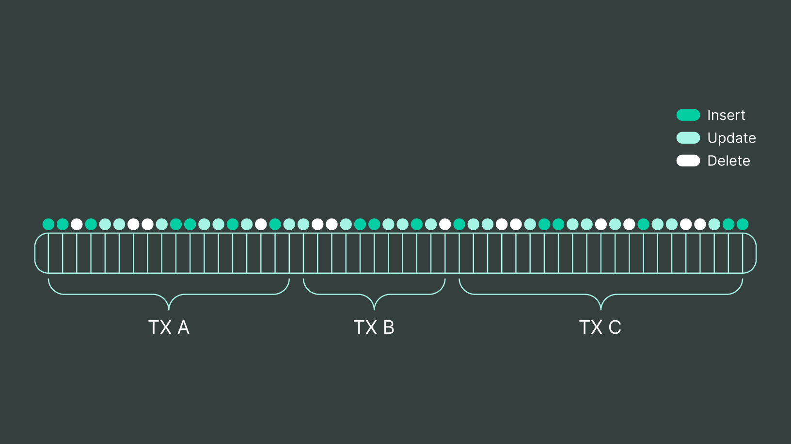
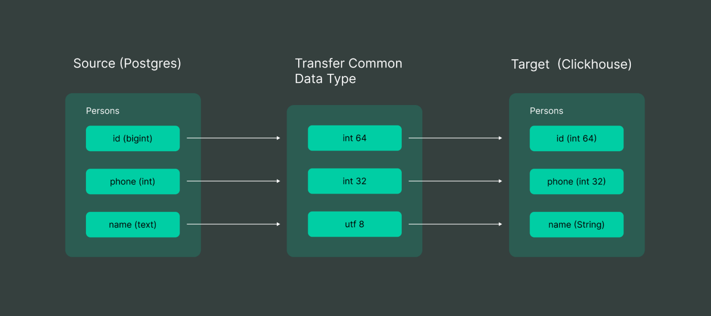
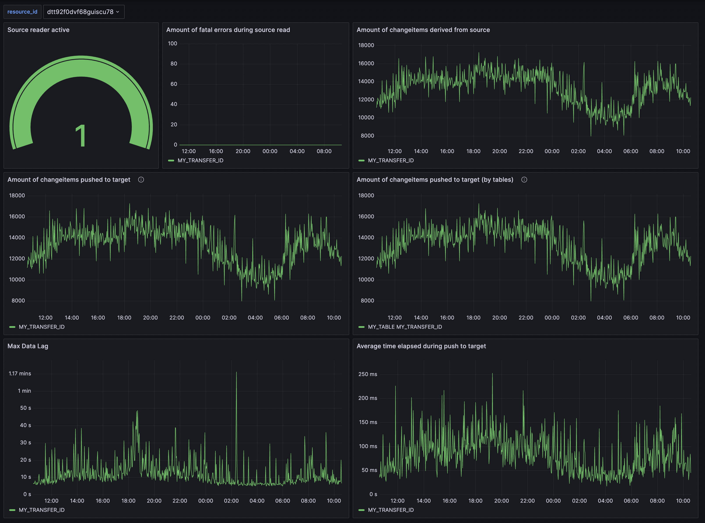
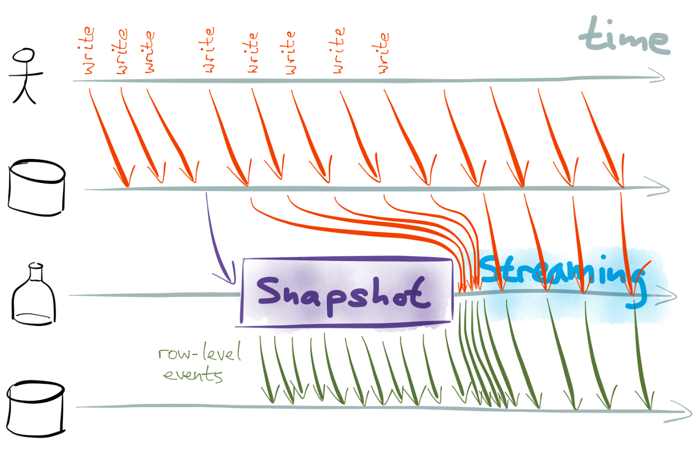
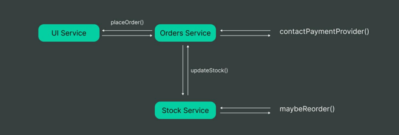
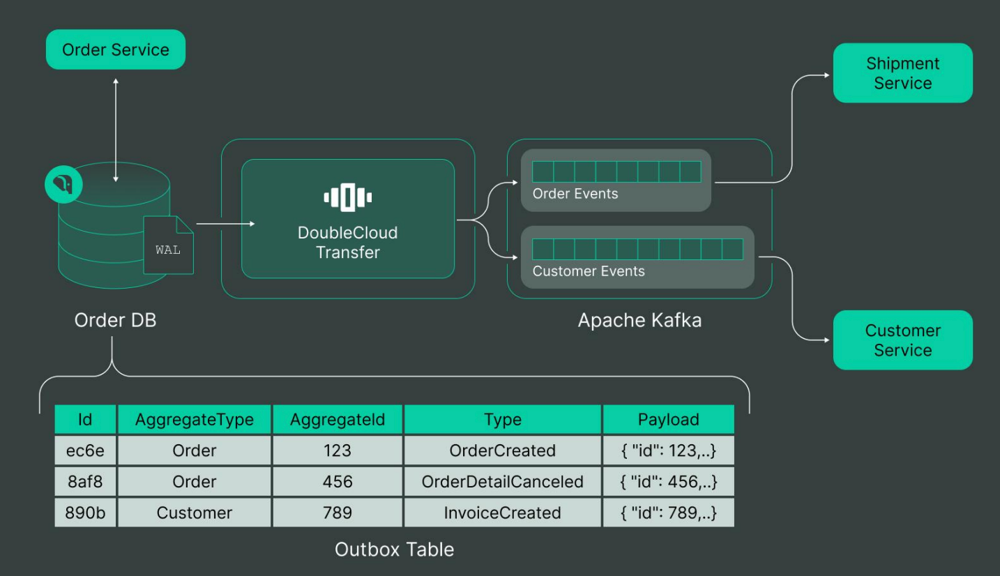

# Overview

Once a company achieves steady growth, it organically arrives at the point where it needs different types of databases to manage its workload. The growth of various databases is a natural process involving trial and error. Since there is no magic recipe, each database you implement has unique advantages for specific use cases.

This process continues beyond a single solution. Once the variety of implemented flows becomes wide enough, engineers face the data integrity problem.

There are several techniques to achieve data integrity, each with pros and cons.

To minimize such an effort and to be able to integrate different databases, we designed and developed the **{{ data-transfer-name }}** - an eventually consistent, event-driven data ingestion, synchronization and processing system that connects different databases and provides an easy way to synchronize data.

The white paper is structured as follows:

1. **Introduction**: An overview of the purpose and goals of the system.
2. **Systems Overview**: A brief overview of current systems that require different approaches for data synchronization.
3. **Architecture Overviw**: High level principles around {{ data-transfer-name }} architecture.
4. **Replication Techniques**: Description of the main replication techniques and application scenarios.
4. **Data Integrity**: Discussion of how to achieve data integrity across different types of storages and possible design decisions.
5. **Challenges**: Description of the main challenges encountered while building the system as a service.
6. **Case Studies**: In-depth analysis of some case studies where the system was used and how it helped.
7. **Conclusions**: A summary of the main points and conclusions drawn from the paper.

# Introduction

When a company grows, it usually observes a pattern for applications to utilize multiple database systems where each one of them is used to serve a specific need, such as:

* storing the canonical form of data (PostgreSQL etc.),
* providing advanced analytical capabilities (ClickHouse etc.),
* storing an archive in a data warehouse (Hadoop etc.),
* and more.

Typically, when using multiple database systems, one acts as the primary store, and the others as derived stores. With this variety comes the challenge of keeping all the systems in sync.

We observed the teams trying to address cross-system synchronization, and they consistently arrived at a series of distinct patterns, such as:

* Dual writes,
* Scheduled copy jobs,
* Distributed transactions.

Our study demonstrated the limitations these approaches tend to have concerning feasibility, robustness, and maintenance. Beyond data synchronization, some applications must change their data to hide sensitive information or enrich them from static dictionaries.

Another significant factor is the team's choice when integrating a database system to fit their requirements.

There is no need for small service teams or internal tools to create complex data storage systems - standard approaches work well with open-source software. To handle the transactional workloads, they usually take open-source relational databases, such as PostgreSQL or MySQL; sometimes, they even go for NoSQL solutions, such as MongoDB or Cassandra.

For analytical workloads, teams usually use cloud-native data warehouses (like Snowflake) to solve most common analytical problems and integrate service data with shared data cubes. Small services don't usually have strict latency or resource consumption requirements, but they must keep data integrity across those storages.

A typical small service has a dozen to hundreds of gigabyte-sized primary databases and a terabyte-sized data warehouse. Big or high-load service teams working in the fields like search, ad tech, e-commerce or game dev face classic solution limitations leading them to a hard choice - move to in-house systems or try to scale open-source products to fit new requirements.

It may lead to adopting cloud-native transactional databases like DynamoDB and real-time extensions to data warehouses like BigQuery.

Another big challenge for such services is event data delivery (user clicks, system metrics, logs, or event streams). There is a solid niche for such Kafka-like or cloud-native systems.

Usually, services want to write their logs to some Kafka-like system and then deliver them to a data warehouse and/or analytical platform. A typical service produces from a dozen Mb/s to several Gb/s of log data. Such services usually have the most strict requirements for data latency and integrity.

The microservice architecture is steadily growing in popularity, pushing large services to decompose themselves into many smaller ones, which drives the small-sized service count even higher.

A typical service wants to have transactional storage at its back and sync it with a data warehouse and analytic cube. Some high-load services can't fit into a typical open-source installation and may replace transactional storage in favor of cloud-native solutions.

We created** TS** as an eventually consistent, event-driven data synchronization and processing service to connect multiple storage types and provide an easy way for data from one storage to be available in another.

Before starting the development process, we had to overcome the following challenges:

* A full data transfer for most databases can't be effectively parallelized, so we have a natural throughput limit. That may lead to minutes or hours, or even days of lag between the start of copy and the finish.
* Each full copy may create an excessive source and target database load.
* Such a tool must support an ever-growing number of databases, leading to infinite possible source-target combinations. Each endpoint pair usually has its unique tooling with unique options and problems.
* Teams in charge of data must control the pipelines and usually struggle with single-point monitoring and alert problems.
* Most teams do not just need to transfer data as is - they need the ability to apply simple transformations to their data upon transfer.
* Primary storage may frequently change schema over time with product development.

The first step in overcoming the above challenges was to formulate the requirements for the product carefully.

## Summarizing the requirements

After careful analysis, we crystallized our requirements for the future **{{ data-transfer-name }}** product as follows:

* **Minimize Delivery Lag**: The system must guarantee that data is delivered with a freshness lag of only a few seconds to be considered useful.
* **Guarantee Quality of Data**: The system must provide data with inferred schema from source tables and guarantee consistency between storages, with eventual consistency being acceptable.
* **Serializable Intermediate Format**: The system must provide a uniform intermediate format to transport data, with the option to route traffic through a persistent queue.
* **API for Configure Deliveries**: Each team must be able to configure its data pipelines with an API provided for this purpose without contacting the **{{ data-transfer-name }}** team.
* **Integration with Processing Framework**: The system must integrate with the processing framework to allow for modifications to data, such as
    * Filtering,
    * Computation,
    * Enrichment from static dictionaries.
* **Cloud Native Service**: The system must be cloud-native to ensure seamless data movement and minimize the impact on product teams.
* **Minimal Impact**: The system must minimize the impact on source and target databases and its system cost for each data pipeline.

To start developing, we needed to decide on the appropriate data sync technique. After carefully considering the available options, we used *snapshot* and *replication* storage integrations.

To add a new pair of storages, we implemented an interface for the data source and data sink, which abstracts details about a specific database from **{{ data-transfer-name }}**:

* Each *source* may implement snapshot or replication provider interfaces.
* Each* target* must support the upsert operator and be able to apply our internal DDL command.

The source database may also have a replication mechanism if it supports replication. In such cases, **{{ data-transfer-name }}** pretends to be a replica of the source database and consumes, transforms and pushes data to a sinker.

To minimize development efforts and system complexity, we must have some universal intermediate format for data to add new adapters for source or target databases easily.

Many middlewares exist between the source and sink for metrics collection, transformers application and logging.

Here’s a draft for your architecture overview in the same style as the linked article:

---

## Architecture Overview

The system is built around a **core module** that acts as the central part of the application, managing its internal logic and facilitating communication between components. Users can interact with the system through either a **Command-Line Interface (CLI)** or via a **Component Development Kit (CDK)**, which serves as a library of interfaces for embedding functionality into external systems.

*Architecture*:

At its heart, the application follows a **plugin-based architecture**, enabling extensibility and modularity. 
Plugins are integrated at **compile time** as Go dependencies, ensuring tight integration and optimal performance. 
The system is implemented as a **Go monolith**, providing a streamlined and cohesive runtime environment.

The core connects to **plugins** in various domains, such as **connectors** (e.g., S3, PostgreSQL, ClickHouse), or **transformers** (e.g., renaming or SQL transformations). 
These plugins are further glued together by **middlewares**, enabling data processing and transformations to be seamlessly chained. 
A shared **data model** ensures consistent communication between components, while **connectors** handle all database specific logic, **transformers** do computations based on shared **data model** and a **coordinator** manage and state tracking and coordination between nodes of **{{data-transfer-name}}** deployments.

This modular approach allows the system to remain flexible, robust, and scalable while adhering to Go's principles of simplicity and high performance.

*Dataplane overview*:

We must handle each delivery as a separate entity or resource to be able to configure it in a centralized way. This realization led us to make the runtime engine pluggable to use any IAS cloud provider or container management service (like k8s). Each runtime here is a simple stateless worker executor running a job binary with provided options.

The Data plane can track the status of a job and process commands to the job from our coordinator service.

# Systems overview

**{{ data-transfer-name }}** was designed to provide a unified approach for managing data pipelines across various data platforms, including OLTP, queues, and data warehouses. Its main goal was to ensure consistency and efficiency in managing these pipelines.

Here is a brief overview of what kinds of data platforms we connect.

## Data warehouses

The data warehouse and processing platform is designed for storing big, huge or even enormous data. It utilizes a distributed file system (DFS) and a distributed meta-information tree designed for storage (for example, HDFS or just S3), which can store files and metadata.

Sometimes it also uses something for a locking mechanism via tools like Apache Zookeeper.

Some data warehouses can be simple file storages (like an S3-based solution) with multiple small files in common data formats like CSV or Parquet.

Some large clusters designed for massively parallel processing of big data using MapReduce operations, and coordination across geo-distributed locations, have the following characteristics:

* Store thousands of petabytes of data.
* Utilize HDD, SSD, and RAM for data storage.

In practice, data in data warehouses is structured into tables.

### Static tables

Static tables are a classic type of table in the DWH systems. "Static" implies that the table data is not easy (not cheap) to update. Physically, such tables are divided into parts (chunks), each chunk containing a fragment of the table entries. A good example of a static table is delta-lake or Apache iceberg table formats.

It’s practically impossible to change the data in a static table. The exception is data merging and deletion, but such operations can take long (many minutes or even hours). Another exception is the operation of adding records to the end of the table.

In the case of a sorted table, records added to the end of the table should not violate the sort order. The data stored in tables, files, and logs is broken into chunks. The chunk stores a continuous range of data; in particular, each table chunk contains a certain range of rows.

A chunk is an immutable entity: its data is never modified after creation.  It is not recommended to make chunks too small because, first, this leads to an increase in their number, which consumes the memory of master servers, and second, small chunks slow down reading as the number of read requests grows.

### Dynamic tables:

Dynamic tables in TS implement a point-by-point reading and writing interface for data by key, supporting transactions and native SQL dialect. Dynamic tables add the capabilities of a typical key-value storage system to **{{ data-transfer-name }}**.

Elementary actions with such tables are:

* Writing.
* Deleting and reading a row by key.
* Executing an SQL or SQL-like query (used for working with row ranges).

Dynamic tables support transactions according to the MVCC model; working with them does not require communication with the **{{ data-transfer-name }}** master server, providing additional scaling opportunities.

While the static tables are immutable, the dynamic ones can be updated so that we can apply replication to them.

The closest functional open-source implementations are:

* HBase - in terms of data storage organization;
* Spanner - in terms of transaction implementation;
* Impala - in terms of a query calculation model.
* [YTSaurus](https://ytsaurus.tech/) - in terms of their dynamic tables.

And from the proprietary cloud realm:

* Google Spanner - also with full ACID support;
* Microsoft Azure CosomosDB

Dynamic tables usually should be strictly schematized, i.e., all column names and their types must be specified in advance in the table specification. Data modification in dynamic sorted tables is performed in the context of transactions. To isolate the transactions and resolve conflicts, **{{ data-transfer-name }}** uses the MVCC model. The default isolation level is a snapshot (not a serializable snapshot). Each value stored in a sorted dynamic table is annotated with a timestamp.

## Message brokers

A message broker is a scalable service for transferring ordered data streams. It allows you to exchange messages through message queues using the `pub/sub` model.

Message brokers provide:

* **Reliability of storage** - confirmation of recording ensures that the message has been reliably written to disk.
* **High availability** - the message broker cluster is present in 5 data centers; write and read operations are redirected to another cluster when one cluster fails.
* **Horizontal scalability** - message queues consist of partitions allowing you to scale the message flow horizontally in one queue.
* **Guarantee of order **- messages are transmitted to the consumer in recording order.
* The `at least once` delivery semantics, with the possibility of implementing `exactly once` with support on the client side.
* The ability to differentiate access by ACL model for staff users, staff groups, services or applications.

To work with data, message brokers provide a "`topic`" entity - a message queue, and a "`consumer`" or “`read-group`,” a named entity for reading data from a topic. The consumer contains reading positions for each topic.

Some examples of such message broker implementations are:

* AWS Kinesis,
* Google Pub/sub,
* Azure Eventhub,
* Apache Kafka.

We currently have integrations with Apache Kafka, AWS Kinesis and Azure EventHub and plan to support more soon.

## Open-source taps

The open-source world is full of ready-made connectors to different sources: from various APIs (Google Analytics, for example) to online collaboration services like Google Docs. Thus, we do not build a connector to such systems from the ground up but integrate available solutions into the service.

As the base for such connectors, we use Airbyte. **{{ data-transfer-name }}** supports any Airbyte connector as a snapshot source. We work with these connectors as a virtual database with a specific API via the Airbyte protocol.

There are two major components in the Airbyte Protocol: *Source* and *Destination*. These components are referred to as Actors.

A source is an application described by a series of standard interfaces. It extracts data from an underlying data store. A data store in this context refers to the tool where the data is actually stored. A data store includes

* Databases,
* APIs,
* Anything that produces data,
* Etc.

For example, the PostgreSQL Source is a Source that pulls from Postgres (which is a data store). A Destination is an application described by a series of standard interfaces that loads data into a data store.

The key primitives that the Protocol uses to describe data are *Catalog, Configured Catalog, Stream, Configured Stream*, and *Field*:

* **Stream** - describes the schema of a resource and various metadata about how a user can interact with that resource. A resource in this context might refer to a database table, a resource in a REST API, or a data stream.
* **Field** - refers to a "column" in a Stream. In a database, this would be a column; in a JSON object, it is a field.
* **Catalog** - a list of Streams that describes the data in the data store that a Source represents.
* **Configured Catalog** - a subset of databases.
* **Configured stream** - a set of table options. For example, you can specify which columns need to be read.

An Actor can advertise information about itself with an Actor Specification. One of the main pieces of information the specification shares is the information needed to configure an Actor.

The above concepts relate to the **{{ data-transfer-name }}** internal logic and allow easy integration. Airbyte sources allow connections to more than 200+ different databases.

The bridge between Airbyte and **{{ data-transfer-name }}** makes integrating publicly available (open-source) and private connectors to the database easy.

# Data replication techniques

Data replication is a crucial topic in the concept of storage. Each storage that aims to be durable must store data in several replicas. There are several techniques to achieve durable data storage, the most popular ones based on transaction logs.

The typical creation of replicas has 2 phases: snapshot load and transaction log streaming.

Since **{{ data-transfer-name }}** supports various databases, we must remember that each has a subset of features we may expect.

We intentionally decided to treat them all as a source and target equally, but some may or may not support streaming or snapshot. It must support at least a snapshot or transaction log source to include storage type into **{{ data-transfer-name }}**.

## Snapshot load

Another important topic is the issue of load distribution and latency. Here we have two conflicting requirements.

One states that we must minimize latency. To achieve it, we have to load our data in parallel, usually leading to more resource consumption on the side and **{{ data-transfer-name }}** itself. Regarding the **{{ data-transfer-name }}** resource consumption, it doesn't matter since total work time is even with or without parallel, but storage may be prone to overload.

Another requirement is that we must not overload it. Without knowing the definition of overload, we should provide control over how much it is loaded. All connected databases are different (not only in type but also in installation). We cannot choose a single workload, and we must provide users with a tool for controlling the degree of parallelism and/or throttling strategies that could drive snapshot costs down.

Snapshot load takes two stages - `pre-processing` and `processing`.

At the pre-processing stage:

1. The table is cut into shards (by the number of shards configured or inferred from the target) according to the specified sharding key.
2. Shards are cut into partitions for additional parallelization and reading from the source.
3. Entries are grouped into blocks; each block is compressed for subsequent transmission over the network.
4. Cooked shards are stored in the task state in the **{{ data-transfer-name }}** directory in the shards subdirectory.
5. A prepared shard is a set of partitions, each row of which contains one block (data column) along with metainformation (format, compression, row count columns, etc.).
6. All blocks are fixed at the pre-processing stage and do not change upon insertion.
7. All lines generated at the pre-processing stage are validated against the schema registry for data integrity. If the pre-processing is successful, shards should contain only valid blocks that can be safely inserted into the target tables.

At some sources, it is possible to run this stage in parallel even for a single table (like ClickHouse); other DBMS may not have such a feature (like PostgreSQL), so we have to run it in a single thread per shard per table.

At the pre-processing stage, the table is segmented into shards, each of which is a collection of disjoint table rows. Filling shard in a first approximation works like this: it subtracts this sequence, inserts it into the table and periodically records progress.

The sequence of shard blocks is virtual. Physically, the blocks of one shard are distributed across several partition tables.

The shard loader cuts the input (virtual) sequence of prepared (at the preprocessing stage) shard blocks into fixed-size packs and commits the progress after the completion of the insertion of all blocks of the next pack of the shard. A barrier is established between the packs: blocks from the next pack are only inserted once all blocks from the previous pack are inserted.

Shard filling will continue from the last uncommitted block pack in case of interruption and restart of the task. This may lead to duplicates over the snapshot load process. Users may choose different strategies to handle it.

For example, ClickHouse has a deduplication engine, which will drop inserts that the server has already accepted during a previous run; all we have to do is replay the same insert (it compares the hash sum of data).

For other targets, we may consider reducing parallel batch processing to one or adding a derived state tracker that will transactionally mark parts as done in the target database progress table, so we could restore the previous state from the target (if it supports transactions).

Each pack is inserted under a transaction with a lock on the original shard and commit offset with the commit of this transaction; offset moves at both sides - source and targets.

The uploads of different shards run in parallel and independently in different jobs. Reading blocks for one shard are paralleled by a partition key (inferred or configured).

The order of inserting blocks inside one bundle can be arbitrary, so the upload does the parallel insertion of blocks of the pack through different replicas of the shard and several connections to the same replica.

During upload, the shard availability of the target database is monitored. If the monitor loses the quorum (each target may define its own rule of defining that quorum) of the shard target, then new inserts into the shard are blocked.

The motivation is simple: if only 1 out of 3 sharded machines is available, then the inserted data is not replicated, so it is easy to lose it if only one machine fails.

The upload job may crash or be interrupted by the user at an arbitrary moment of execution. Still, it can be started again (for example, on another machine) and continue copying until successful completion. Restarting should not lead to losses or duplicates in the copied data (of course, modulo some assumptions).

In the process, the task fixes the current stage (creating shards, filling shards, creating tables etc.). When restarting, the task skips the completed stages and begins work by repeating the last incomplete.

All tables manage operations are idempotent, so we skip it completely on restart. Shard upload jobs capture their progress, and only a small fraction of the inserts are retried.

## Transaction log streaming

Once a snapshot is uploaded, we can start replication from the prepared replication log position. When the snapshot is completed, we start the streaming job. We could start one or more jobs depending on the source shard count. Usually, one shard needs one independent executor (or `worker`) to complete the replication process.

Most traditional database systems offer access to their replication log, which allows clients to learn about the updates happening in the database in real time. Many infrastructures for real-time apps are built on top of this functionality. Despite the differences in implementations, they often operate with similar abstractions. By identifying the lowest common denominator, we can begin synchronizing data between systems seamlessly.

**{{ data-transfer-name }}** supports transaction semantics across multiple database types. For each change in source storage, it can annotate and propagate required metadata such as transaction ID, storage commit timestamp and log sequence number (or `LSN`). The worker is a stateless pull process, not preserving any own state.

The transport layer supports guaranteed at least once delivery semantics by default; it will commit progress to source storage once the sinker acknowledgment is received. An event may be delivered multiple times only in the case of failures in the communication channel between the source and sinker or a hard failure in the **{{ data-transfer-name }}** worker process. Therefore, the target database (or `Sink`) must be idempotent in applying the delivered events or maintain transactional commit semantics aligned with the source.

One of our objectives was to standardize change-log events. It gives us fast storage integration and may simplify custom application integration. As the most common discriminant, we decide to stay on the following change-log event structure:

* **ID** (`uint64`) The unique identifier for the operation. Each store has its own semantics but is often derived from a transaction identifier.
* **Commit Time** (`uint64`) Unix epoch time for transaction in nanoseconds. All databases have such functionality, so we rely on the clock on the source database.
* **Kind **(one of` INSERT | UPDATE | DELETE | DDL`) kind of event. Change-log may be one of `insert/update/delete`. Also, we must reserve special events for DDL operations. Since our source storage can alter greatly, we must add one more type.
* **Table** (`string`) Name of the table from which the event was acquired.
* **Values** (`[]any`) List of column values. Values are serialized to some common format (JSON or proto).
* **OldValues** (`[]any`) List of column values before change applied. It may be filled only in the `UPDATE` event kind. Values are serialized to some common format (JSON or proto).
* **TableSchema** (one of` Schema | SchemaID`) List of columns that contain these events. To minimize serialized value, we may use `SchemaID `in our schema registry. Each schema has a unique monotone-grown sequence. `SchemaID` is also unique and monotone; the sinker may decide to try to alter data once the previously upserted `SchemaID` is before the current one. `SchemaID `refers to the schema registry. We’ll discuss this more in-depth in further sections.

This format is easy to apply to any database. All it needs is to insert, update or delete rows. But since we support various databases, some event types are not supported.

Our connected storages are split into two major groups:

* **Mutable databases** and
* **Immutable databases**.

Mutable databases are transactional or NoSQL databases (PostgreSQL, MySQL etc.).

The immutable ones are analytical databases. They have limited support for updates and deletes, requiring a different approach. We use the raw format for such databases as append-only logs, which store raw logs and optional applications for “`INSERT ONLY."` The user may implement a cron task for such tables, which transforms and accumulates the raw logs into a point-in-time replica of the source database.

## Data transfer

When **{{ data-transfer-name }}** replicates the table to a sinker, it holds the transaction log. Each target storage may struggle from downtimes that may affect the source database. For example, it may consume most of the free space on a relational database for transaction logs - more convenient for services with a decent database load.

We may build more complex pipelines from one database to another to minimize such problems. For example, we may set up a connector to read the source table and push it to the message broker's target, which then can be a source for another connector that replicates the initial target, allowing us to build more complex pipelines with fan-out replication or event-complete directed acyclic graphs (`DAG`s).

## Processing

**{{ data-transfer-name }}** may be used as a stateless stream processing application. It may be represented as a composition of edges (i.e., connectors) between processing nodes (databases) arranged in a DAG. We support multiple databases, some of which can be chained. A good example is message brokers, a database or node for **{{ data-transfer-name }}**, but it contains only a change-log of streamed data.

The library for processing data uses a SQL-like engine residing entirely in memory (clickhouse-local, similar to DuckDB). The tables are slices of arbitrary objects in memory and work to process a data stream of known length in advance. In this mode, we may do simple queries of the form "`SELECT ... WHERE`" are available, "`FLATTEN BY`" additionally possible to do aggregation using "`GROUP BY`."

Each source is a stream of events with table operations. The list of tables is unknown; each table has its own data structure (defined as a schema). Users may provide a map of SQL queries for each table to transform. For now, we have decided to simplify our window selection techniques. The user configures a simple `memory + time` strategy: we read the `N-size` bucket from the source in `M-seconds` until we flush it to the transformers and the sinker.

Such pipelines usually require some intermediate checkpoint storage. For such cases, the user may configure a persistent storage-based message pipeline. Each step in this pipeline is a separate connector or flow. Usually, the first step is message brokers, where users write their own events data. All intermediate steps connect message brokers to each other with a specified SQL script.

We decided not to provide any system-generated joins, but the users may implement some joins from a SQL script with embed / external in-memory dictionary. The output stream of the connector is written to a persistent store, and the next connector treats this target as its own source.

This method proves to be the most reliable. In addition to multiplexing, a persistent store allows the input and output processors to write and read at different speeds, at different points in time, and to read the same data multiple times, e.g., to recover from a processor failure.

The connectors are decoupled from each other, so the failure of a single connector does not affect other connectors, significantly impacting the stream processing system's fault tolerance, performance, and scalability.

# Data integrity

The critical aspects of data replication are consistency and integrity. Multiple design decisions address these aspects within our service. First, we decided not to build a strict, consistent system but to aim to be eventually consistent. Those allow us to minimize latency and be more aggressive in parallelization (such as table-level parallelization). Each table owns its version: a pair of transaction IDs and commits time. At each point in time, the whole state of the replicated target may be inconsistent, but each table must be consistent.

To allow optional user point-in-time consistency, we may deliver raw events log into the target so that the user may restore a point-in-time snapshot from that log.

## Delivery semantics

The delivery semantics of each connector determine its correctness and fault tolerance. We need to support several different delivery semantics. Since we support various databases with their mechanisms, we must have flexibility in semantic strategies. Using at least one stream as input is acceptable for some storages since we may upsert data instead of inserts. Upserts are not an option for analytical databases, so we must find a solution.

The **{{ data-transfer-name }}** worker does the following types of work:

1. **Consume input**. For example, it may consume bin logs from some checkpoints. This work usually runs without side effects; we pull data in memory and deserialize it to a common type.
2. **Process input**. Based on the input stream of events and in-memory state, it processes it via YQL transformers and generates output for a target for further processing or serving. This can happen as source events are processed or can be synchronized before or after a checkpoint.
3. **Push output**. Take generalized output and push it to target storage. This work type has side effects, so it must be handled carefully. Before insertion, we check the progress tracker for which part of incoming data is stale and must be skipped.
4. **Store checkpoints**. Save checkpoints to a database for failure recovery. We must store both source and target database checkpoints. Initially, we store the target checkpoint; if the database supports the transaction, we try to do so in the same transaction as the output write. Some targets do not support transactions. For them, we use separate system tables for progress tracking. Once we store the progress of the target, we may commit progress to a source. For some databases, it's important to store checkpoints as fast as possible since internal processes can't clear used transaction logs.

The implementations of these activities, especially the checkpoints, control the processors' semantics. There are two kinds of relevant semantics:

1. **Source semantics**: each source event counts `at-least-once` or `exactly-once`.
2. **Target semantics**: a given output value shows up in the output stream `at-least-once` or `exactly-once`.

The different state semantics depend only on the order of saving the offsets between the source and target.

* **At-least-once state semantics**: save the target offset first, then save the source offset.
* **At-most-once state semantics**: save the source offset first, then save the target offset.
* **Exactly-once state semantics**: we may create exactly-once processing from an at-least-once source by skipping duplicate data before sinker; this is implemented as optional middleware with derived state storage. The only thing required for that is the ability to store progress inside the target database in the same transaction as the original insert.

We allow the user to choose which semantic applies to him. By default, we do not force the `exactly-once` and stay on the `at-least-once`. The tricky part is that the most popular storages support the `upsert` operation, and most source databases provide natural primary keys. By implementing `upsert` by default, we have a ready solution to handle duplicates.

## Summary

From a contractual point of view, consistency at the table/row level **makes no difference** to us. We cannot determine clear signs to define with what level of assurance we have read the data from the source.

A streaming primitive. An endless stream of CRUD events line by line. Conceptually, there are only three types of events in logical replication - `create/edit/delete`. For editing and deleting, we need to identify the object with which we operate, so to support such events, we expect the source to be able to give them.

For some storages, such events can be grouped into **transactions**.

Once we start the replication process, we apply this stream of actions to the target and try to minimize our data lag between the source database and the target.

At the replication source level, we maintain multiple levels of consistency:

### Row

This is the most basic mechanism. If the source does not link strings to each other, there is a guarantee only at the string level. An example of MongoDB in FullDocument mode, each event in the source is one row living in its timeline. Events with this level of assurance do not have a transaction tag and logical source time (LSN) or are not in a strict order.

### Table

Suppose the rows begin to exist in a single timeline - we can provide consistency at the table level. In that case, applying the entire stream of events in the same order as received gives us a consistent slice of the table. Eventually, events with this guaranteed level don’t have a transaction stamp but contain a logical source timestamp (LSN) and a strict order.

### Transaction

Suppose the rows live in a single timeline and are attributed with transaction labels and linearized in the transaction log (that is, there is a guarantee that all changes in one transaction are continuous and the transactions themselves are logically ordered). In that case, we can give consistency at the table and transaction levels. Applying the entire stream of events in the same order with the same (or larger) batches of transactions, we will get a consistent table slice from the source at any moment.

## Target

Each of our Targets is a simple thing that can consume a stream of events; at its level, the target can both support source guarantees and weaken them.

### Primitive

At the most basic level, the target simply writes everything that comes in (the classic example is the` / fs / s3` queue). At this level, we do not guarantee anything other than writing everything that comes in (while the records may be duplicated).

### Unique key deduplication

The Target can de-duplicate the row by the primary key, in which case we give an additional danger - there will be no key duplicates on the target.

### Logical clock deduplication

If the Target can write up to 2 tables in a single transaction, we can transactionally store the source logical timestamp in a separate table and discard already written rows. In this case, the targets will have no duplicates, including lines without keys.

### Transaction boundaries

If the receiver can hold transactions for an arbitrarily long time and apply transactions of arbitrary size, we can implement saving transaction boundaries on writes. In this case, the sink will receive rows in the same or larger transactions, giving an exact source segment at any time.

## Summary

For maximum guarantees (exact slice of the source at any point in time), both the source and the destination should give maximum guarantee between themselves.

For some storages, we have the following approximate matrix:

<table>
  <tr>
   <td>Storage Type
   </td>
   <td>S/Row
   </td>
   <td>S/Table
   </td>
   <td>S/DB
   </td>
   <td>S/Slot
   </td>
   <td>R/Row
   </td>
   <td>R/Table
   </td>
   <td>R/TX
   </td>
   <td>T/Rows
   </td>
   <td>T/Keys
   </td>
   <td>T/LSN
   </td>
   <td>T/TX
   </td>
  </tr>
  <tr>
   <td>PG
   </td>
   <td>+
   </td>
   <td>+
   </td>
   <td>+
   </td>
   <td>+
   </td>
   <td>+
   </td>
   <td>+
   </td>
   <td>+
   </td>
   <td>+
   </td>
   <td>+
   </td>
   <td>+
   </td>
   <td>+
   </td>
  </tr>
  <tr>
   <td>MySQL
   </td>
   <td>+
   </td>
   <td>+
   </td>
   <td>+
   </td>
   <td>
   </td>
   <td>+
   </td>
   <td>+
   </td>
   <td>+
   </td>
   <td>+
   </td>
   <td>+
   </td>
   <td>+
   </td>
   <td>+
   </td>
  </tr>
  <tr>
   <td>Mongodb
   </td>
   <td>+
   </td>
   <td>
   </td>
   <td>
   </td>
   <td>
   </td>
   <td>+
   </td>
   <td>
   </td>
   <td>
   </td>
   <td>+
   </td>
   <td>+
   </td>
   <td>
   </td>
   <td>
   </td>
  </tr>
  <tr>
   <td>ClickHouse
   </td>
   <td>+
   </td>
   <td>
   </td>
   <td>
   </td>
   <td>
   </td>
   <td>
   </td>
   <td>
   </td>
   <td>
   </td>
   <td>+
   </td>
   <td>
   </td>
   <td>+
   </td>
   <td>
   </td>
  </tr>
  <tr>
   <td>Greenplum
   </td>
   <td>+
   </td>
   <td>+
   </td>
   <td>+
   </td>
   <td>
   </td>
   <td>
   </td>
   <td>
   </td>
   <td>
   </td>
   <td>+
   </td>
   <td>+
   </td>
   <td>+
   </td>
   <td>+
   </td>
  </tr>
  <tr>
   <td>Oracle
   </td>
   <td>+
   </td>
   <td>+
   </td>
   <td>+
   </td>
   <td>+
   </td>
   <td>+
   </td>
   <td>+
   </td>
   <td>+
   </td>
   <td>+
   </td>
   <td>+
   </td>
   <td>+
   </td>
   <td>+
   </td>
  </tr>
  <tr>
   <td>YDB
   </td>
   <td>+
   </td>
   <td>+
   </td>
   <td>
   </td>
   <td>
   </td>
   <td>
   </td>
   <td>
   </td>
   <td>
   </td>
   <td>+
   </td>
   <td>+
   </td>
   <td>
   </td>
   <td>
   </td>
  </tr>
  <tr>
   <td>Airbyte
   </td>
   <td>+
   </td>
   <td>+/-
   </td>
   <td>
   </td>
   <td>
   </td>
   <td>
   </td>
   <td>+/-
   </td>
   <td>
   </td>
   <td>+
   </td>
   <td>+/-
   </td>
   <td>
   </td>
   <td>
   </td>
  </tr>
  <tr>
   <td>Apache Kafka
   </td>
   <td>+
   </td>
   <td>
   </td>
   <td>
   </td>
   <td>
   </td>
   <td>+
   </td>
   <td>
   </td>
   <td>
   </td>
   <td>+
   </td>
   <td>
   </td>
   <td>
   </td>
   <td>
   </td>
  </tr>
  <tr>
   <td>EventHub
   </td>
   <td>+
   </td>
   <td>
   </td>
   <td>
   </td>
   <td>
   </td>
   <td>+
   </td>
   <td>
   </td>
   <td>
   </td>
   <td>+
   </td>
   <td>
   </td>
   <td>
   </td>
   <td>
   </td>
  </tr>
</table>

## Type system

We need to unify all database types, so we implemented the **Common Type System** across data storage and processing in {{ data-transfer-name }}. This system must cover all supported databases.

The Type System provides classes and conversion rules representing common Type System types. It allows for constructing in-memory representations of types, inspecting said representations, combining them to derive new types, and serializing and deserializing them. For those familiar with [Protobuf](https://protobuf.dev/), Type Info implements the concept of message descriptors for the type system.

### Built-in types

Type system provides built-in types similar to the most commonly used types. For convenience, the types are divided into groups.

**Types of integers**:

* `Bool` is a boolean type with two values: true and false.
* `Int8` is a signed integer, one byte.
* `Int16` is a signed integer, two bytes.
* `Int32` is a signed integer, four bytes.
* `Int64` is a signed integer, eight bytes.
* `Uint8` is an unsigned integer, one byte.
* `Uint16` is an unsigned integer, two bytes.
* `Uint32` is an unsigned integer, four bytes.
* `Uint64` is an unsigned integer, eight bytes.

**Types of floating point numbers**:

Floating point numbers are number types that store values in the form of a mantissa and exponent, in accordance with IEEE-754.

* `Float` is a floating point number, four bytes.
* `Double` is a decimal number; for type fullness, we store it in a string format. We can cast it to the most precise floating point data type in most databases.

**Types of strings**:

Strings are types for working with text and binary data.

* `String` is an arbitrary binary blob.
* `Utf8` is text encoded in `Utf8`.

**Time types:**

Time types are used for storing time. Since the underlying language we use is Golang, we are bound to its capability of transferring time-like types. A Time represents an instant in time with nanosecond precision, but for some defined types, we can round this precision down to:

* `Date `- a day.
* `Datetime` - a second.
* `Timestamp` - the most precise one.

### Additional Data Types

There are essentially two type-systems - `open` and `closed`. We decided to go with an open-type system.

Open-type systems declare an infinite type conversion by adding opaque data type. In a matter of simplicity, we define everything that is not as simple as the type above as `ANY` data type. The only requirement for this type is to be somehow serializable (usually JSON). Each such type is open for improvement by adding extra type tags. This tag is usually invisible to the user and only used by the system itself (or as part of target data serialization). Most `ANY` types are, in fact, container data types.

### Container data types

Container types are parametric types that provide common data structures. We define several containers to simplify data integration.

* `Optional &lt;T>` - a container that may or may not contain a value of type T. Most databases have such a concept as nullable columns. Each nullable column transforms into this container type.
* `List &lt;T>` - a list of values of type T. In general, a List is translated into a dynamic array. Most databases support this container.
* `Dict &lt;K, V>` - an associative container that maps to one key of type K exactly one value of type V.

It's hard to support the full spectrum of container types for all databases since they may contain complex nested structures. Only a limited number of storages have native support for such types. If we face a source or target with limited complex type support, we downcast it to JSON built-in.

## Schema consistency

**{{ data-transfer-name }}** uses schematized serialization of events and supports schema versioning and evolution, providing an isolation layer that protects consumers from upstream changes in the schema. The source provides a schema infer into a common schema by inspecting the source tables.

The following diagram shows a simple PostgreSQL table mapped to a common type schema.

There are some intricacies when mapping data types, e.g., when you have a column defined as a number in MySQL, which int do you use when referring to the column? We decided to use the most widespread type that can cover all possible values, which sometimes may lead to a strange string inferring, but it is the only choice in some cases. Not all databases support separate schema change events; we must monitor stream data values for some. Once it contains something unusual (for example, the number of columns changed or the 3-rd value becomes a different type), we reload the schema from the source and compare it with the latest schema in the registry.

Once a schema is inferred, the event is enriched with it. We usually store schemas in the schema registry and get schema ID. In this case, the schema is represented by a unique FQDN and system-defined ID. When the Schema Registry assigns the ID, it generates it from the table name and schema version sequence number. So each user can compare schema IDs with each other to define which one is newer.

We can work without a registry by enriching each event's schema object. This is a flexible choice, but it generates excessive size to be transferred when we use persistent queues as transport. When the fetcher generates new events from this table, it serializes them with this schema. When a table evolves, its schema changes, and **{{ data-transfer-name }}** attaches a newer version identifier. All new events are now serialized with this new schema version identifier.

**{{ data-transfer-name }}** ensures that changes to the source schema do not affect consumers, and they can upgrade at their cadence. The **{{ data-transfer-name }}** target performs automatic schema conversion using Avro's standard schema resolution rules. Each target implements its unique subset of evolution strategies. We can expect the following changes to the schema:

* `Column added` - the most common use case: we add a new column.
* <code>Column type extended</code><strong> </strong>- for example, when we change <code>int32</code> column to <code>int64</code>
* <code>Column type narrowed</code><strong> </strong>- for example, when we change <code>int64</code> to <code>int32</code>
* <code>Column removed </code>- we remove a column completely
* <code>Change in primary keys</code><strong> </strong>- change the order or count of primary keys

Each database has its capabilities. For schema evolution, see Table 1.

For those DDL operations that are not supported, the user must commit to the handle strategy. We propose the following:

* **Reupload** - we stop replication, optionally move the current state of the table into the archive table and then start to snapshot the current table state. Once it finishes - we continue to replicate it. We do not want to trigger it too fast, so we throttle down the initiation of reupload for some time (configured by the user); by default, it is 1 hour.
* **Ignore and continue** - user remove broken tables, alert the users and continue. All data related to this table will be lost; to restore this table, the user must manually add it to the transfer. This is the default strategy.
* **Drop and continue **- user drops the broken table and continues without snapshot loading. Optionally, we could move old data to the archive.
* **Panic and stop** - we alert the user and stop replication. This is the strictest strategy, but it has an advantage since not consuming transaction logs for a long time may lead to failure in some database types.

Each strategy has pros and cons, so users must define what fits their requirements best.

# Challenges

Providing something as a service requires us to provide some guarantees for fault tolerance.

## Connector-defined challenges

Several storage-related issues may appear.

### Source misconfiguration

Since we store a connector configurator in the database, it may become outdated. For example, users may change a password from the database and not update the corresponding connector config. We cannot guarantee that such errors do not happen, but by integrating with cloud service API, we could minimize errors and detect such scenarios early.

Once we understand that such errors exist, we fail our connector jobs and notify users.

### Storage failure

Each storage provides sanity check rules to detect its aliveness. Once it fails, we implement a retry and notify policy. Users may decide how long the connector can wait until the next replication retry.

Once we exceed the limit in replication, we fail our connector jobs and notify users.

### Network outages

Each storage is typically located in several **availability zones** (**AZ**). Once we start replication jobs, we try to locate the jobs in the same or nearest data center to minimize latency and cross-dc traffic. Sometimes the network may drop or break completely. For such cases, we implement a job rotation policy.

Once we exceed a retry count of network-related issues, we move to another AZ. If all AZs still have network-related issues, we stop retrying, fail our connector jobs and notify users.

## System-defined challenges

We may expect problems with the **{{ data-transfer-name }}** server besides source or target-related failures.

### Failure of connector worker

Since our worker is stateless, such failures are not a big deal for us. All we need to do is restart our jobs. If the job host is not responding, the system will try to locate a new one.

### Failure of coordinator worker

The coordinator worker is also stateless but may lock some connectors as the primary master. Once it fails, it will lose a lock, and the next worker instance will take it. With a new primary master, we continue to function as usual.

### Network failure between coordinator and connector

Each primary master coordinator makes periodic ping connections to workers. Once we lose a connection between a worker and coordinator, we may face two possible scenarios - worker failure or network outages. We implement a backward connection from the worker to the coordinator to detect which one is it. Workers periodically push its metrics to the coordinator and random instances of the coordinator group, not only to master. Instances receiving worker requests will keep metrics in storage; the primary master may poll it.

## Monitoring and alerting

To provide convenient service, we measure replication system metrics. Metrics from left to right:

* `Lag delivery ` \
  Distribution of lines on the delivery lag. The configured timestamp is taken as the starting point. If not specified - Write the Time from the source (recording time). \

* `Traffic` \
  The amount of traffic read from the log broker after decompression but before parsing. \

* `Memory consumption` \
  Shows how much data is "in flight"; it exists in the source or worker but has not yet received a response from the target sink. \

* `Parsed VS not parsed` \
  Shows the ratio of the rows (in number), how many were parsed, and how many were not parsed. Also, it tracks how many records skipped from table exclusion rules (this row goes to the `not parsed `counter). \

* `Insertion speed` \
  Distribution of rows by insertion time. It measures how long it took to insert this line into the target sink (from when parsing is completed until the target response). \

* `Maximum delivery lag` \
  A single number of seconds representing the oldest row replicated to a sink.

All these metrics describe the health of the replication process. We design an SLO that is based on values in these metrics and measure each violation of it. For example, we expect each table to be replicated in 10 seconds in the 95 percentile on a day scale.

## Scaling

One of the key parameters of the system is scalability. We distinguish two types of scalability: **Horizontal** and **Vertical**.

The Horizontal one is the ability of the system to accept new pairs of connected storages. Since we have many, often small databases, growing in breadth was key. We needed to address multiple coordination and isolation issues to provide this capability.

* The Data Plane is a specific replication process running in some runtime environment.

When solving scalability problems, we approached the scalability of the Data Planes separately.

The Data Plane is generally a stateless data-pumping process. All state is stored in external storage (either in the source if it supports transactions or in an independent corruption-resistant database). Such a process is easily scalable simply by adding new Data Plane instances.

Now, we need to decide where and how to start them. We faced the task of running the service in multiple heterogeneous environments, leading to one of the key design decisions - the separation of the runtime for the Data Plane from the system itself. We formulated the basic requirements for what could serve as a specific connector's runtime. A runtime is a system capable of initiating replication (in other words, starting a Data Plane process) in a given availability zone with a given network interface. The system must also allow for the on-demand shutdown. Allocation of such a random time frame made it possible to control the state of running works in the Data Planes. By choosing **K8S** as a Runtime for **{{ data-transfer-name }}**, we have provided ourselves with almost endless scaling of the number of connected storages.

However, Data Plane faced the problem of heterogeneous storage loads. Some of the connected storages were less loaded than others, which led to the need to consider the vertical growth of a particular replication db. It is essential to understand that not all sources allow horizontal growth. Most relational databases (PostgreSQL or MySQL) have a purely single-threaded logging process, and reading it out in multiple threads is impossible; all we can do for them is maximize the direct read time delegated post-processing to other processes. This is usually not a problem for most connected databases, but we did not have time to read and process the data in a single job for a number of heavily loaded services. We split the job into read and write jobs to solve this problem. The reading job is always one per database shard. It reads data and sends it to the persistence queue (Apache Kafka / kinesis) immediately, without any special processing. Then several parallel processing workers read from this queue and write to the original destination database. This system allowed us to connect even the busiest databases to our replication system.

## Overhead

Since the replication system is often used for replication to analytical repositories, we had a requirement to minimize the overhead costs. We separate these costs for the system (resources required to run replication jobs) and the additional load on connected databases.

The overhead for specific replication jobs is relatively stable and depends on the traffic on the source storage. Depending on it, we choose how many cores and memory to allocate to the replication container. We spend the majority of time reading, parsing data and serializing it into a transport format. And while the cost of serializing to transport format is contingent, the total overhead for source log parsing depends on the type of system (and source log format). For each attached storage, we estimated parser throughput to understand the limits and scaling rules for replication jobs.

The load on the source storage results from additional network traffic and the time the storage spends on journal retrieval. To minimize network traffic, we place replication workers in the same places where the source storage is located - this saves both read latency and network traffic between data centers.

The time it takes for storage to render a log depends on many factors, and each storage has its peculiarities. But all storages have common practices that reduce the additional load. The primary saving technique is to read the freshest logs; fresh logs are usually in the page cache, speeding up response time and reducing the consumption of scarce IO. However, there is a storage activation problem where we must read historical data, creating an additional IO burden. The good news is that it has to be done once. The bad news is that we can't consume the log in parallel and read a snapshot of the historical data. Thus we burden not only IO for reading the snapshot but also IO for reading the old logs which have accumulated while reading the snapshot (which can take 24 hours).

Another dangerous point is that logs accumulated during the time of proofreading the snapshot can easily take up all the free space on the masters, which will make the cluster inaccessible for writing. We have implemented parallel reading of the snapshot and the journal to solve these problems. The journal is written to the persistent queue together with the snapshot. When the snapshot finishes, we start consuming the journal from the queue, and the storage optimizes its log usage.

The additional cost of a persistent queue is generally not high and is equal to the value of the log, but not all storage requires such a complex scheme. If the storage can survive log accumulation on its side, we run replications without an intermediate queue, which saves not only queue resources but also reduces lag.

## Case studies

### Data warehousing

Operational databases are not a good choice for running heavy analytical workloads as they can hinder the performance of regular OLTP operations. Therefore, operational data must be moved to a specialized system, such as a data warehouse, to run analytical queries that power the BI and reporting needs.

There are two approaches; ETL is the traditional method of periodically batching operation data and loading them to the warehouse. The downside of ETL is the latency. But with CDC, you can capture source system changes as they happen and deliver them to the warehouse in real time.

Today, many data warehouses allow loading data in a streaming manner. AWS Redshift, Google BigQuery, Apache Druid, and Apache Pinot are a few examples.

The key scenario of using the system is archiving data in data warehouses. Consider an example of replication from PostgreSQL to ClickHouse. As a source, we have a runtime database that the application uses for its work. As the destination analytical database in which the analytical cubes are prepared, analysts want to minimize the delay in data delivery. The source size is substantial (`1` `Tb` in `5 shards` and `1500 writing transactions per second`). A snapshot copy of the data into the analytics cube is downloaded for 24 hours, sometimes even more. Such regular queries, while not overloading the database (since they use read-only secondary instances), bring difficulties in analytics since the freshness of the data is low.

To solve this problem, we used the transfer manager and reduced the delivery lag to analysts from days to units of seconds. It also allowed us to remove secondary instances allocated for these regular tasks. The delivery lag is `1 / 2.7 / 15` (`50 / 95 / 99` percentile).

### Log delivery

In YandexCloud, most of the logs are delivered and processed by **{{ data-transfer-name }}**. For this purpose, all applications write their logs in a structured (JSON) form to an Apache Kafka topic and then configure the process of delivering logs from these topics to the repositories. **{{ data-transfer-name }}** can parse such topics into structured tables and deliver them to the target (e.g., S3 and ClickHouse).

This approach scales well horizontally since each partition can be read by an independent transfer process (worker) for delivery. Thus, **{{ data-transfer-name }}** can transparently transfer both single lines per second and hundreds of thousands of lines per second with a delivery lag of: 0.5 / 1 / 5 (50 / 95 / 99 percentile.

Monitoring tools (graphs and alerts), problem logs and scaling tools (parallelism degree settings) are available for the user.

With **{{ data-transfer-name }}**, any size log delivery pipelines are easily scalable.

### Data migration

Another important use case is migration from one storage system to the same storage system type but in a different location (e.g., from a hardware host to a cloud database). **{{ data-transfer-name }}** allows you to configure migrations between systems of the same type.

Let us consider an example of a service migration to ClickHouse.

As a source, the service has two large (several terabytes) and loaded (thousands of reading and hundreds of writing transactions per second) hardware ClickHouse clusters for services. All these clusters must migrate to a ClickHouse cluster managed by some cloud, with the migration happening gradually. First, the code starts reading from the hardware and cloud cluster, and after a few weeks, the writing switches. We created a set of transfers for each cluster to copy the data. Since these large clusters work under high loads, we must run tasks in parallel (sharded).

These frequency characteristics allow us to migrate the service without much need for additional logic.

### Event-driven update of materialized views for microservices

A persistent queue (Apache Kafka) in connectors lets us consume our increments and event streams from the source table with user code.

It's even more beneficial with microservices architecture - it promotes having a database per service to keep data that is private to the service. Although that improves the autonomy and scalability across services, that can lead to some complications.

For example, when a service tries to access the data owned by another service, the only way is by making an API call. But this model is not scalable when there are cascading API calls involved. The consumer has to perform inefficient in-memory joins to still the responses from multiple services.

As a remedy, microservices rely on `Command Query Responsibility Segregation` (`CQRS`) pattern to decouple state mutations from queries. Instead of querying services in real-time, services can listen to the domain events coming from downstream systems and update internal materialized views to perform queries locally. That improves the read performance, overall system availability, and autonomy.

### Real-time data auditing

It is a common requirement for business applications to maintain an audit log, i.e., a persistent trail of all the changes to the application’s data.

In its natural form, a change data capture (`CDC`) system like **{{ data-transfer-name }}** captures, stores, and propagates changes according to the order in which they were applied to the source system. Thus, the target system that receives this data can build up the chronological order in which changes have been applied to the source system and trace them back to a specific time.

Changes can be enriched with information from external systems to provide a holistic view that would aid in the forensic analysis of incidents. For example,  by replaying the audit log from the beginning, one can find answers to who did what action at which time.

### Reliable microservices data exchange with the outbox pattern

Another problem common to microservices is reliably updating data across multiple service boundaries. For instance, consider a microservice that manages purchase orders. When a new order is placed, information about that order may have to be relayed to a shipment service and customer service.

The saga pattern helps to solve this problem to some extent. But implementing a Saga is often complicated and brittle due to its synchronous nature.

CDC comes into the picture by capturing changes made to an Outbox table and propagating them to downstream Microservices in a reliable and eventually consistent manner.

## Conclusion

Data integrity is critical for most modern companies. As our industry is speeding toward the data-oriented world, it will remain a fundamental part of working with data. **{{ data-transfer-name }}** addresses main data integration concerns that organizations have today:

* **Delivery Lag**: Leaning to the real-time analytics, we provide sub-second lag and replication techniques.
* **Transfer Speed**: Parallel execution capability allows us to reach very high transfer speeds.
* **Data Quality**: We support a variety of data consistency techniques and approaches for different use cases.
* **Security**: We provide our service in a managed and secure manner; we try not to store any unnecessary intermediate data and keep data in the user’s secure perimeter, and we do not keep any personal data on our side.
* **Cost**: We try to keep our pricing policy customer-friendly, transparent, reasonable and human-readable.
* **Manageability**: The system operates in a cloud, and the user is not concerned about maintenance or deployment.
* **Compatibility**: Integration with well-known open-source formats (Parquet, Debezium) and protocols (Airbyte, SQL) enables easy integration with existing toolkits.
* **User-friendliness**: Managed service provides an easy-to-use UI, so it can be consumed by engineers and by solving and keeping most of the complexity under the hood.

Discover the power of our new, meticulously tested, and optimized **{{ data-transfer-name }}**. It is the data migration tool tailored to meet your needs.
