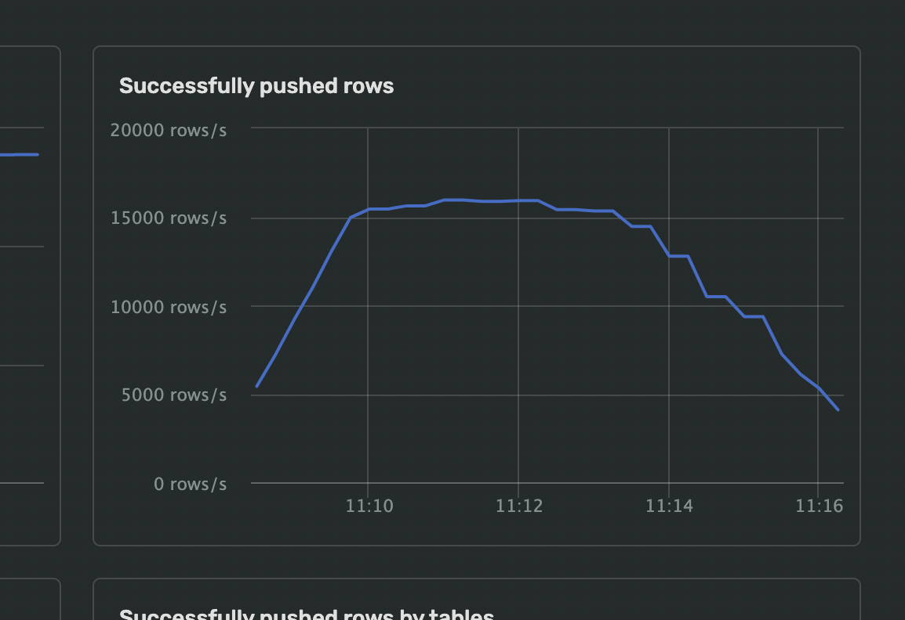

# Guide

This guide outlines the steps to benchmark database transfer services using a robust dataset from [ClickBench](https://github.com/ClickHouse/ClickBench). ClickBench provides a wide table with 70 columns and approximately 100 million records. Follow these steps to ensure efficient and reliable benchmarking.

---

## 1. Preparing a Data Set

### Steps:
1. **Find a Dataset**  
   Identify the correct dataset; most databases have their own backups.

2. **Prepare the Source Database**
    - Set up a source database on ec2 instance.
    - Use a pre-production serverless runtime environment.

3. **Load the Data**  
   Import the prepared dataset into the source database, ensuring it aligns with the benchmarking scenario.

---

## 2. Setting Baselines

Baselines provide reference points to measure performance.

### Steps to Set Baselines:
1. **Define Key Metrics**
    - Key metric: Rows per second (preferable over bytes/s due to variable byte sizes).
    
2. **Perform Initial Transfer**  
   Execute an initial transfer from the source to the target database using default settings.

3. **Record Performance Metrics**
    - Document the metrics from this initial transfer.
    - Key metric: Rows per second for single-core throughput.
    - Example: Measure total transfer time or use metrics like rows/sec.
    - 

---

## 3. Optimizing Transfers

After setting baselines, fine-tune the transfer settings for better performance.

### Optimization Steps:
1. **Activate the Transfer**  
   Deploye transfer via [helm](./deploy_k8s.md) in your k8s cluster.

2. **Expose pprof for Profiling**
    - Expose the pprof port for profiling, by default `--run-profiler` is true.

3. **Download the pprof File**
    - CPU profiles are accessible at `http://localhost:{EXPOSED_PORT}/debug/pprof/`.
    - 
    - Profiles typically sample for 30 seconds.
    - 

4. **Visualize the Profile**
    - Use tools like [Speedscope](https://www.speedscope.app/).
    - 
    - Upload the profile to analyze call stacks.
    - 
    - Use the "Left-Heavy" view to identify high-time-consuming paths.

---

## 4. Improving Performance

There’s no silver bullet for performance improvement, but here are some resources:
1. **[One Billion Row Challenge in Golang](https://r2p.dev/b/2024-03-18-1brc-go/)**  
   Techniques for IO/CPU optimization in data parsing.

2. **[Minimizing Allocations in Golang](https://gist.github.com/CAFxX/e96e8a5c3841d152f16d266a1fe7f8bd)**  
   Focus on reducing object allocations.

3. **[Analyzing Go Heap Escapes](https://landontclipp.github.io/blog/2023/07/15/analyzing-go-heap-escapes/)**  
   Use escape analysis for up to 10% performance improvements.

4. **Competitor Baselines:**
    - [Benchmarking Postgres Replication: PeerDB vs Airbyte](https://blog.peerdb.io/benchmarking-postgres-replication-peerdb-vs-airbyte#heading-parallelism)
    - [Reading Large Postgres Tables - Lessons from Airbyte](https://airbyte.com/blog/reading-very-large-postgres-tables-top-4-lessons-we-learned)

### Debugging Notes:
- If the 30-second CPU profile shows less than 30 seconds, the bottleneck is likely outside the hot path.

---

## 5. Writing Benchmarks

After optimization, write benchmarks to simulate real-world workloads.

### Metrics to Minimize:
1. **`ns/op`**: Time per iteration (lower is better).
2. **`B/op`**: Memory allocated per iteration (lower is better).
3. **`allocs/op`**: Allocation count per iteration (lower is better).

### Metric to Maximize:
1. **`MB/s`**: Throughput in bytes per second (higher is better).

Example Code:
```go
b.SetBytes(int64(totalSize * limit))

BenchmarkTextFetcher/128_rows-10      1567      756604 ns/op    86.79 MB/s    421344 B/op     10820 allocs/op
```

---

## References

- [ClickBench Repository](https://github.com/ClickHouse/ClickBench)
- [Speedscope Visualization Tool](https://www.speedscope.app/)
- [Additional Optimization Articles](https://airbyte.com/blog/postgres-replication-performance-benchmark-airbyte-vs-fivetran)

--- 

This guide provides a systematic approach to benchmarking and optimizing database transfer tools. Utilize these steps to measure, enhance, and achieve efficient data migrations.
