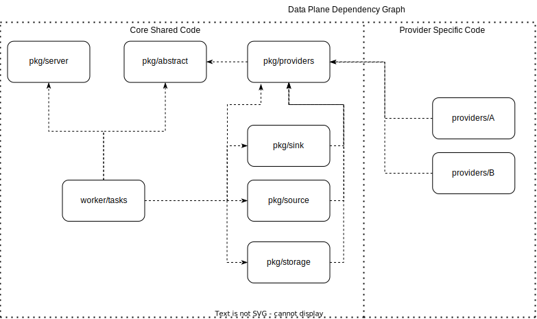

# Extensibility

{{ data-transfer-name }} integrates with open-source tools and supports custom extensions:

## Open-Source Integrations
- Airbyte connectors for a wide range of databases and APIs.
- Supports over 200 connectors via Airbyte protocol.

## Custom Extensions
- Developers can implement new source/target adapters using {{ data-transfer-name }}'s universal intermediate format.

This extensibility enables seamless integration with diverse data ecosystems.

## Custom Providers

Each integrated data storage is combination of provider interface.
**Provider** is a struct that combine enabled features of storage that this provider implements.
Bare minimum implementation for providers looks follow:

```go
// Register provider factory into data plane provider registry
func init() {
	providers.Register(ProviderType, New)
}

// Define new ProviderType enum value
const ProviderType = abstract.ProviderType("my-awesome-provider")

// Provider impl
type MyAwesomeProvider struct {
	logger   log.Logger
	registry metrics.Registry
	cp       coordinator.Coordinator
	transfer *model.Transfer
}

// Define type for new provider Imple
func (p MyAwesomeProvider) Type() abstract.ProviderType {
	return ProviderType
}

func New(lgr log.Logger, registry metrics.Registry, cp coordinator.Coordinator, transfer *model.Transfer) providers.Provider {
	return &Provider{
		logger:   lgr,
		registry: registry,
		cp:       cp,
		transfer: transfer,
	}
}
```

### Depenency graph

Provider is one of core interfaces. Each specific provider register itself in providers registry.
Each task/sink/storage construct anything provider-related from providers registry.




## Custom Transformer

We can apply stateless transformation on our `inflight` data.

### How to add new transformer

1. Create new package
2. Implemenet `abstract.Transformer` interface
3. Register implementation

Example:

#### Implementation of `abstract.Transformer`

```go
type DummyTransformer struct {
}

func (r *DummyTransformer) Apply(input []abstract.ChangeItem) abstract.TransformerResult {
	return abstract.TransformerResult{
		Transformed: input,
		Errors:      nil,
	}
}

func (r *DummyTransformer) Suitable(table abstract.TableID, schema abstract.TableColumns) bool {
	return true
}

func (r *DummyTransformer) ResultSchema(original abstract.TableColumns) abstract.TableColumns {
	return original
}

func (r *DummyTransformer) Description() string {
	return "this transformer do nothing"
}
```

## Custom Parsers

### Parser configs

There should be a constructor function for the parser, for example:

```go
func NewParserAuditTrailsV1(inWrapped interface{}, topicName string, sniff bool, logger log.Logger, registry *stats.SourceStats) (registrylib.AbstractParser, error) {
```

Such a constructor function takes any `parser_config` as its first parameter, and should be able to construct a parser from any of its `parser_config`s.

To register parser and its `parser_config`, you need to call the `registrylib.RegisterParser` function in `init()` in the parser file:

```go
func init() {
    registrylib.RegisterParser(
        NewParserAuditTrailsV1,
        []registrylib.AbstractParserConfig{new(ParserConfigAuditTrailsV1Common)},
    )
}
```

Where we pass:

* A parser constructor function

* A `parser_config` array


And for this to be connected to the assembly, you need to be hooked into `pkg/parsers/registry/registry.go`.

For example, you can check how parsers are declared: `tskv/json`

## Step-by-step alogrith to add a new parser

* For each `parser_config` type (lb/common), you describe UI proto-models (`transfer_manager/go/proto/api/console/form/parsers.proto`) add them to `oneof` in `ParserConfigLb/ParserConfinCommon` (I suggest you forget about API proto-model until they make this api more usable)

* Create a subdirectory in `pkg/parsers/registry` - for example, `myparser`

* For each type of `parser_config` (**lb** / **common**) you create `parser_config` (and tests) - for example, `parser_config_myparser_lb.go`, `parser_config_myparser_common.go` (converters to proto API can be filled with `return nil, nil`)

* Create parser description (for example, `parser_myparser.go`) and `add init()` function with `registrylib.RegisterParser` call

* Add import to this parser in `pkg/parsers/registry/registry.go`

* Add it to `pkg/parsers/registrylib/canon/unit_test.go` - if your parser gets there, then it will get everywhere you need.
