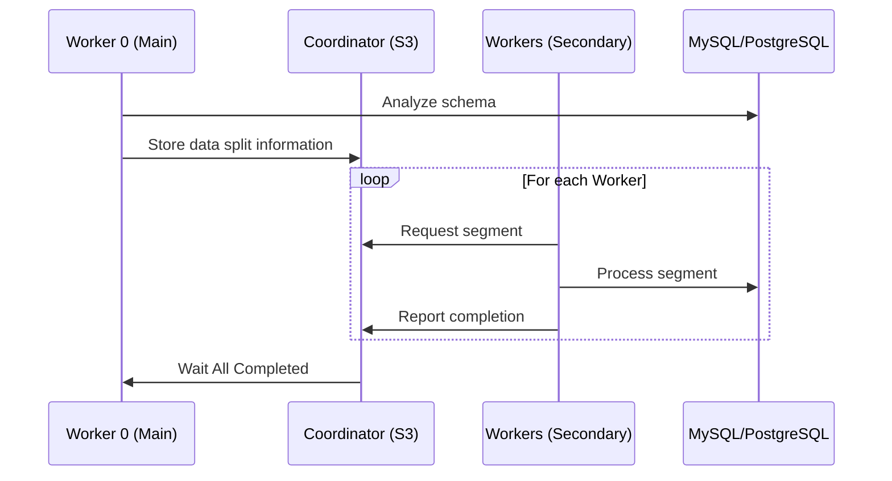

# Scaling

{{ data-transfer-name }} supports horizontal and vertical scaling to meet growing data needs:

## Horizontal Scaling
- Add new storage pairs seamlessly.
- Scales Data Plane independently.

### Snapshot Sharding

1. **Worker with index 0** (initializer) analyzes the database schema and determines partitioning strategies:
   - Uses table statistics.
   - Splits data by PK ranges if possible.
   - Otherwise, applies heuristics (e.g., partitioning by `id % N`).
2. Worker 0 stores the list of segments (value ranges) in the **coordinator** (e.g., S3).
3. **Workers 1..N** request available segments from the coordinator, process them, and report completion.

## Vertical Scaling
- Handles high-load databases by splitting jobs into read and write tasks.
- Supports persistent queues for decoupled processing.

This flexibility ensures {{ data-transfer-name }} can accommodate varying workloads and system architectures.
