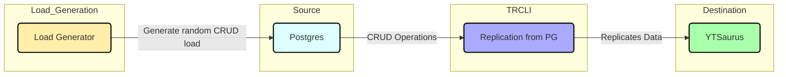
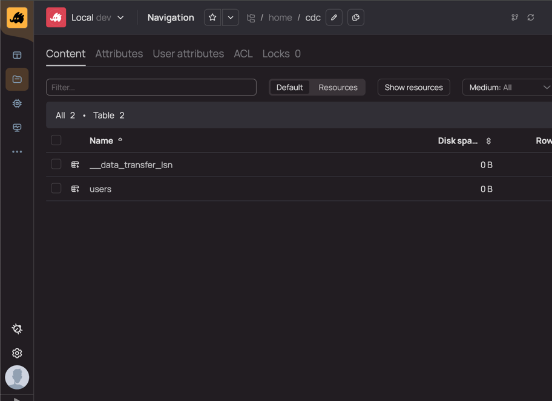
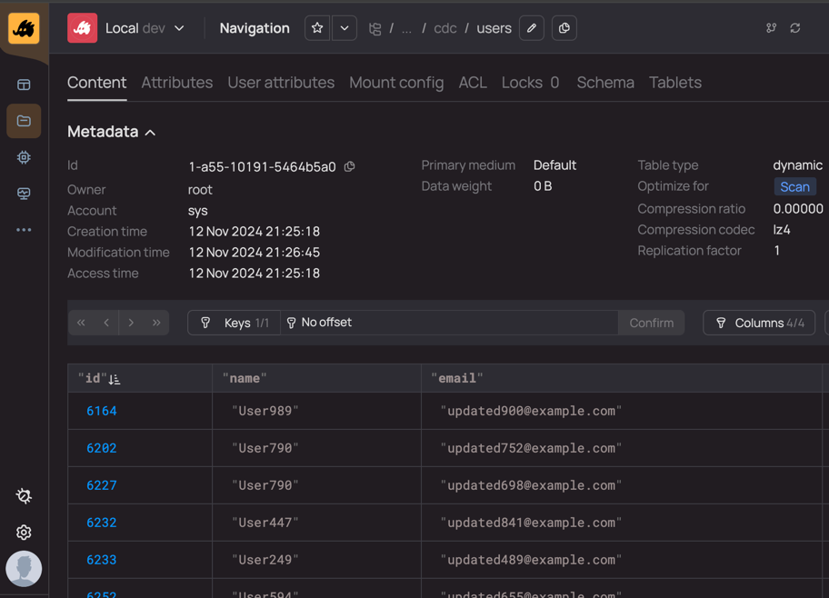

# PostgreSQL to YTSaurus Example

This example showcase how to integrate data from PostgreSQL to YTSaurus in 2 main modes:

1. Snapshot mode, via staic tables
2. Replication (CDC) mode, via sorted dynamic tables

Also we will run end to end docker compose sample with CDC real-time replication from postgres to YT.

## Architecture Diagram

Here's an updated Mermaid diagram with a structure and flow more similar to the visual style in the referenced example:



This diagram introduces `subgraph` elements for grouping, rounded boxes, and adjusted colors to resemble the style and structure of the reference image. Let me know if further adjustments are needed!

## Overview

1. **Postgres**: A Postgres instance is used as the source of data changes.
    - **Database**: `testdb`
    - **User**: `testuser`
    - **Password**: `testpassword`
    - **Initialization**: Data is seeded using `init.sql`.

3. **Transfer CLI**: A Go-based application that replicates changes from Postgres to YT.
    - **Configuration**: Reads changes from Postgres and sends them to YTSaurus tables.

4. **YTSaurus**: An open source big data platform for distributed storage and processing.
    - **Access URL**: [http://localhost:9981](http://localhost:9981) - web UI

5. **Load Generator**: A CRUD load generator that performs operations on the Postgres database, which triggers CDC.

## Getting Started

### Prerequisites

- Docker and Docker Compose installed on your machine.

### Setup Instructions

1. **Clone the Repository**:
   ```bash
   git clone https://github.com/doublecloud/transfer
   cd transfer/examples/pg2yt
   ```

2. **Build and Run the Docker Compose**:
   ```bash
   docker-compose up --build
   ```

3. **Access YT Saurus**:
   Open your web browser and navigate to [web UI](http://localhost:9180) to view resulted tables.

### Using the Application

- Once the Docker containers are running, you can start performing CRUD operations on the Postgres database. The `load_gen` service will simulate these operations.
- The `transfer` CLI will listen for changes in the Postgres database and replicate them to YT.
- You can monitor the changes in YT using the YT UI.

### Configuration Files

- **`transfer_cdc_embed.yaml`**: Specifies the source (Postgres) and destination (YT) settings inside docker-compose
- **`transfer_dynamic.yaml`**: Specifies configuration of CDC transfer outside docker-compose
- **`transfer_static.yaml`**: Snapshot only configuration which delivery on-time copy to static tables.

### Exploring results

Once docker compose up and running your will see main YT Saurus [page](http://localhost:9180):


Based on cdc configuration:

```yaml
dst:
  type: yt
  params: |
    {
      "path": "//home/cdc", # HERE is a target path
      "cluster": "yt-backend:80",
      "cellbundle": "default",
      "primarymedium": "default"
    }
```

Transfer will create a folder inside `//home/cdc` directory:



Here you can see 2 tables:

1. `//home/cdc/__data_transfer_lsn` - system tables that use to track snapshot LSN-tracks to deduplicate in terms of failure
2. `//home/cdc/users` - actual table from postgres

Table consist all data automatically transfered and updated in real-time:




### Stopping the Application

To stop the Docker containers, run:

```bash
docker-compose down
```

## Conclusion

This example provides a complete end-to-end CDC solution using Postgres, YTSaurus, and a Transfer application. You can use it to demonstrate how data can be replicated from a relational database to a YTSaurus data platform for real-time processing.
