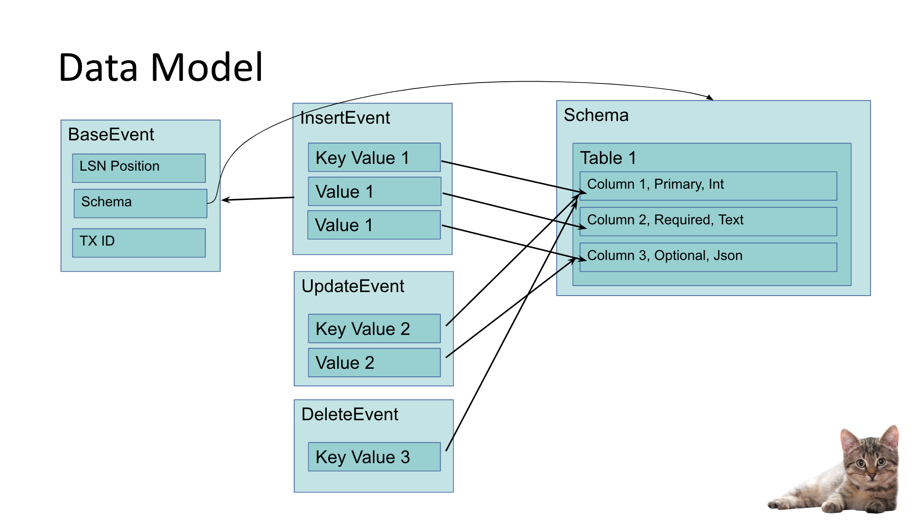
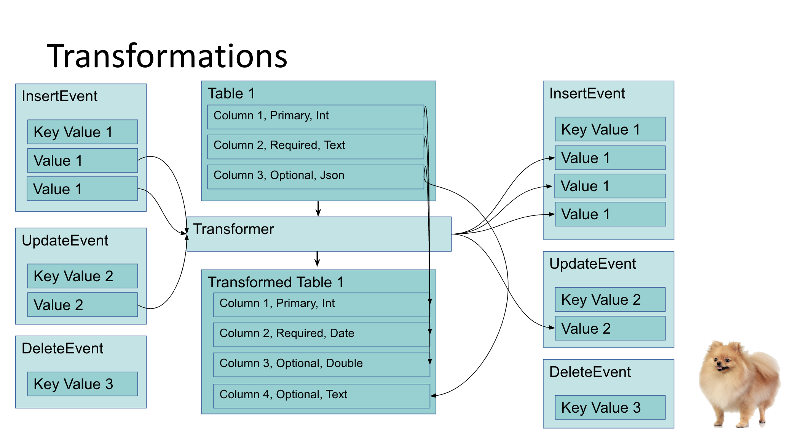

# All transformers for {{ DC }} {{ data-transfer-name }}

## What is transformer

We can apply stateless transformation on our `inflight` data.
This is based on our data model

Each batch of changes can be transformed into new batch of changes:

## List of transformers

* [{#T}](sql.md)

* [{#T}](convert_to_string.md)

* [{#T}](dbt.md)
 
* [{#T}](filter_columns.md)

* [{#T}](lambda.md)

* [{#T}](mask_field.md)

* [{#T}](raw_cdc_doc_grouper.md)

* [{#T}](raw_doc_grouper.md)

* [{#T}](rename_tables.md)

* [{#T}](replace_primary_key.md)
