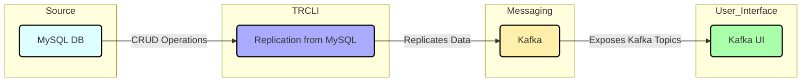

# MySQL to Kafka CDC Example

This repository demonstrates a Change Data Capture (CDC) scenario using a MySQL database, Kafka, and a *trcli* that replicates changes from MySQL to Kafka topics. The setup uses Docker Compose to manage multiple services, making it easy to run the entire application stack locally.

## Architecture Diagram

Here's the corresponding Mermaid diagram:




## Overview

1. **MySQL**: A MySQL 8.0 instance is used as the source of data changes.
    - **Database**: `testdb`
    - **User**: `testuser`
    - **Password**: `testpassword`
    - **Initialization**: Data is seeded using `init.sql`.

2. **Kafka**: A Kafka broker (using KRaft mode) that receives messages from the transfer CLI and exposes them as topics.
    - **Listening Ports**:
        - 9092 (for client connections)
        - 9093 (for internal controller communication)

3. **Transfer CLI**: A Go-based application that replicates changes from MySQL to Kafka.
    - **Configuration**: Reads changes from MySQL and sends them to Kafka topics prefixed with `cdc`.
    - **Parallel Writers**: Utilizes 10 parallel writers to send data to Kafka.

4. **Kafka UI**: A web-based interface to monitor and manage Kafka topics.
    - **Access URL**: [http://localhost:8080](http://localhost:8080)

5. **Load Generator**: A CRUD load generator that performs operations on the MySQL database, which triggers CDC.

## Getting Started

### Prerequisites

- Docker and Docker Compose installed on your machine.

### Setup Instructions

1. **Clone the Repository**:
   ```bash
   git clone https://github.com/doublecloud/transfer
   cd transfer/examples/mysql2kafka
   ```

2. **Build and Run the Docker Compose**:
   ```bash
   docker-compose up --build
   ```

3. **Access Kafka UI**:
   Open your web browser and navigate to [http://localhost:8080](http://localhost:8080) to view and manage Kafka topics.

### Using the Application

- Once the Docker containers are running, you can start performing CRUD operations on the MySQL database. The `crud_load_gen` service will simulate these operations.
- The `transfer` CLI will listen for changes in the MySQL database and replicate them to Kafka.
- You can monitor the changes in Kafka using the Kafka UI.

### Example CRUD Operations

Here are some example commands you might use to perform CRUD operations on the MySQL database:

1. **Insert**:
   ```sql
   INSERT INTO your_table_name (column1, column2) VALUES ('value1', 'value2');
   ```

2. **Update**:
   ```sql
   UPDATE your_table_name SET column1 = 'new_value' WHERE column2 = 'value2';
   ```

3. **Delete**:
   ```sql
   DELETE FROM your_table_name WHERE column1 = 'value1';
   ```

### Configuration Files

- **Transfer Configuration**: The transfer CLI is configured through `transfer.yaml`, which specifies the source (MySQL) and destination (Kafka) settings.

### Stopping the Application

To stop the Docker containers, run:

```bash
docker-compose down
```

## Conclusion

This example provides a complete end-to-end CDC solution using MySQL, Kafka, and a Transfer application. You can use it to demonstrate how data can be replicated from a relational database to a streaming platform like Kafka for real-time processing.
