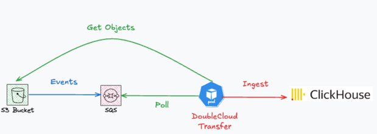

# S3 Replication to Clickhouse

This example showcase how to integrate data from S3 to Clickhouse in replication (CDC) modes:

1. Via polling new files
2. Via fetching new files notifications via SQS


## Architecture Diagram



## Overview

1. **S3**: To prepare s3 backet use terraform provided within this example.

3. **Transfer**: An application that replicates changes from S3 to Clickhouse.

4. **Clickhouse**: An open source big data platform for distributed storage and processing.

5. **Load Generator**: To generate load we will load files to S3 via aws cli command.

## Getting Started

### Prerequisites

- Docker and Docker Compose installed on your machine.
- AWS CLI [here](https://docs.aws.amazon.com/cli/latest/userguide/getting-started-install.html)
- S3 bucket created via terraform [here](./main.tf)

### Setup Instructions

1. **Clone the Repository**:
   ```bash
   git clone https://github.com/doublecloud/transfer
   cd transfer/examples/s3sqs2ch
   ```

2. **Prepare S3 Bucket**:
   ```bash
   terraform init
   terraform apply \
      -var="bucket_name=MY_BUCKET_NAME" \
      -var="sqs_name=MY_SQS_NAME" \
      -var="profile=MY_PROFILE_NAME"
   ```

3. **Access to Clickhouse**:
   Access to ClickHouse via CLI:
   ```bash
   clickhouse-client --host localhost --port 9000 --user default --password 'ch_password'
   ```

4. **Seed S3 bucket with files**:
   ```bash
   #!/bin/bash
    export BUCKET=MY_BUCKET_NAME
    export PROFILE=MY_ACCESS_KEY
    for i in {1..10}
    do
    echo '{"id": '$i', "value": "data'$i'"}' > "file_$i.json"
    aws s3 cp "file_$i.json" s3://${BUCKET}/ --profile ${PROFILE}
    rm "file_$i.json"
    done
   ```

5. **Build and Run the Docker Compose**:
   ```bash
   export BUCKET=MY_BUCKET_NAME
   export ACCESS_KEY=MY_ACCESS_KEY
   export SECRET_KEY=MY_SECRET_KEY
   export QUEUE=MY_SQS_NAME
   export ACCOUNT=MY_AWS_ACCOUNT_ID
   export REGION=MY_AWS_REGION

   docker-compose up --build
   ```


### Configuration Files

- **`transfer.yaml`**: Specifies the source (Mysql) and destination (CH) settings inside docker-compose

```yaml
id: test
type: INCREMENT_ONLY
src:
  type: s3
  params:
    Bucket: ${BUCKET}
    ConnectionConfig:
      AccessKey: ${ACCESS_KEY} # YOUR ACCESS_KEY
      S3ForcePathStyle: true
      SecretKey: ${SECRET_KEY} # YOUR SECRET_KEY
      UseSSL: true
    ReadBatchSize: 1000999900
    InflightLimit: 100000000
    TableName: my_table
    InputFormat: JSON
    OutputSchema: # Schema format, each item here will be resulted in clickhouse column
      - name: id
        type: int64
        key: true # Will be included in clickhouse primary key
      - name: value
        type: string
    AirbyteFormat: ''
    PathPattern: '*.json'
    Concurrency: 10
    Format:
      JSONSettings: {}
    EventSource:
      SQS:
        QueueName: ${QUEUE}
        OwnerAccountID: ${ACCOUNT}
        ConnectionConfig:
          AccessKey: ${ACCESS_KEY} # YOUR ACCESS_KEY
          SecretKey: ${SECRET_KEY} # YOUR SECRET_KEY
          UseSSL: true
          Region: ${REGION}
    UnparsedPolicy: continue
dst:
  type: ch
  params:
    ShardsList:
      - Hosts:
          - clickhouse
    HTTPPort: 8123
    NativePort: 9000
    Database: default
    User: default
    Password: ch_password
transformation: '{}'
type_system_version: 8

```

### Exploring results

Once docker compose up and running your can explore results via clickhouse-cli

Exploring Results
Verify Data in Clickhouse: Open the Clickhouse CLI and run:

```sql
SELECT count(*)
FROM my_table
```

It will prompt:
```sql
┌─count()─┐
│      10 │
└─────────┘
```

If we add more files:

```bash
    export BUCKET=MY_BUCKET_NAME
    export PROFILE=MY_ACCESS_KEY
    for i in {11..20}
    do
    echo '{"id": '$i', "value": "data'$i'"}' > "file_$i.json"
    aws s3 cp "file_$i.json" s3://${BUCKET}/ --profile ${PROFILE}
    rm "file_$i.json"
    done
```

It will automatically ingest 10 more files:


```sql
SELECT count(*)
FROM my_table
```

It will prompt:
```sql
┌─count()─┐
│      20 │
└─────────┘
```


### Stopping the Application

To stop the Docker containers, run:

```bash
docker-compose down
```

## Conclusion

This example demonstrated setting up a CDC pipeline from S3 to Clickhouse using polling and SQS modes. It can be extended to handle large-scale data ingestion and complex transformations.

