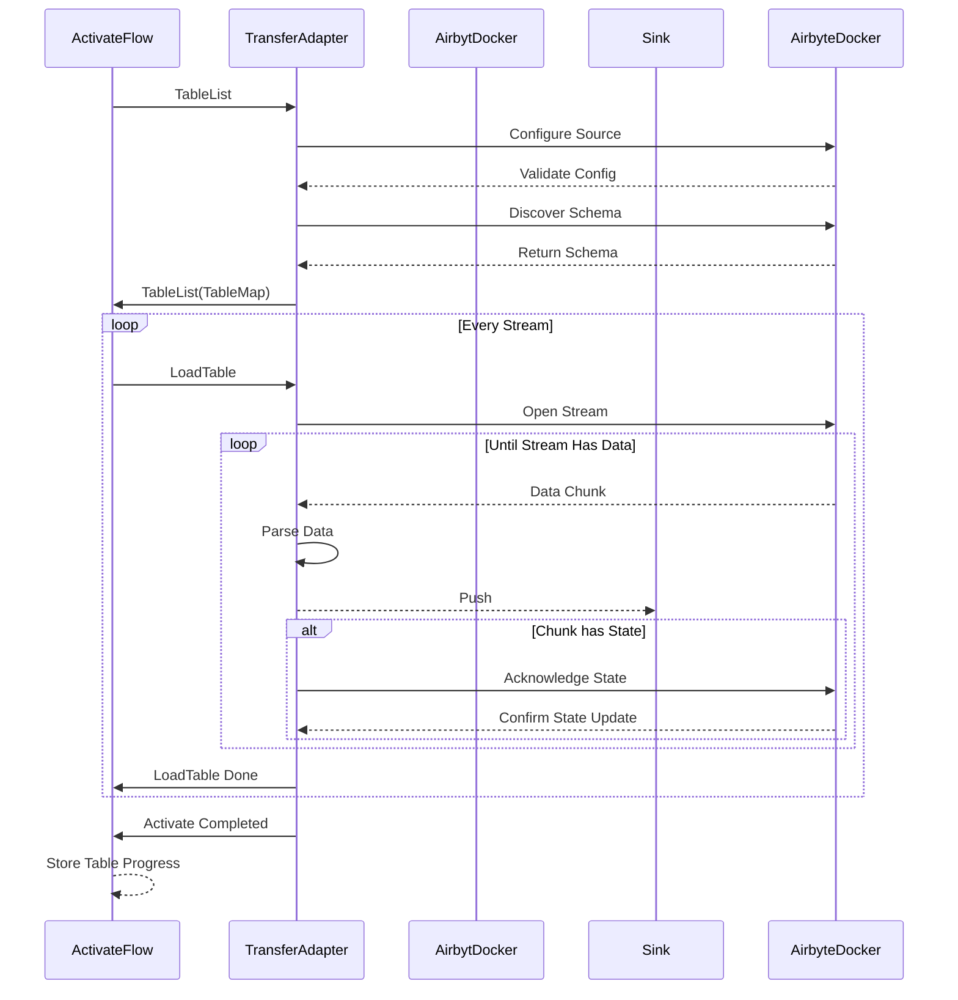

## Airbyte provider

This is a bridge between native transfer and airbyte connector.
This adapter is ideal for scenarios where you need to synchronize data from an Airbyte-compatible source to a Transfer-compatible sink with minimal configuration.

We support source airbyte [connectors](https://docs.airbyte.com/category/sources)

This adapter enables integration between [Airbyte](https://docs.airbyte.com/using-airbyte/core-concepts/) and [Transfer](https://github.com/doublecloud/transfer), facilitating the translation of Airbyte's core concepts into Transfer-compatible constructs for streamlined data movement and transformations.

## Core Concepts Mapping

The adapter maps Airbyte concepts to Transfer as described below:

| Airbyte Concept       | Transfer Equivalent | Description                                                                                                 |
|-----------------------|-------------------|-------------------------------------------------------------------------------------------------------------|
| **Source**            | **Source**        | Airbyte sources are represented as Transfer sources, maintaining the configuration from Airbyte.            |
| **Destination**       | **Sink**          | Airbyte destinations are mapped to Transfer sinks, preserving the target configuration.                     |
| **Stream**            | **TableID**       | Airbyte streams are directly translated into Transfer streams, including their metadata and schema.         |
| **Catalog**           | **TableSchema**   | Airbyte catalogs are used to define the schema of Transfer TableSchema.                                     |
| **State**             | **Coordinator**   | Airbyte's state mechanism is implemented in Transfer Coordinator for incremental updates and checkpointing. |

## Features

- **Comprehensive Integration**: Supports all Airbyte-compatible sources.
- **Flexible Sync Modes**: Full-refresh and incremental sync modes are available, leveraging Airbyte’s capabilities.
- **Streamlined State Management**: Automatic handling of state for incremental updates by using transfer Coordinator
- **Schema Handling**: Seamless propagation of schema from Airbyte to Transfer.

# Airbyte Adapter for Transfer

This adapter enables integration between [Airbyte](https://docs.airbyte.com/using-airbyte/core-concepts/) and [Transfer](https://github.com/doublecloud/transfer), facilitating the translation of Airbyte's core concepts into Transfer-compatible constructs for streamlined data movement and transformations.

## Configuration

The Airbyte adapter supports only source configuration. To configure an Airbyte source, use the `spec` method from the [Airbyte Protocol](https://docs.airbyte.com/understanding-airbyte/airbyte-protocol#spec) to retrieve the schema for the required parameters. Then, create a configuration YAML file as follows:

### Example Source Configuration

```yaml
type: airbyte
params:
  Config: |
      {
          "credentials":{
              "auth_type":"username/password",
              "password":"AWESOME_PASSWORD",
              "username":"AWESOME_USER"
          },
          "database":"AWESOME_DB",
          "host":"https://DB_ID.DB_REGION.snowflakecomputing.com",
          "role":"DB_ROLE",
          "schema":"DB_SCHEMA",
          "warehouse":"DB_WAREHOUSE"
      }
  BatchSizeLimit: 10485760
  RecordsLimit: 10000
  MaxRowSize: 268435456
  Image: "airbyte/source-snowflake:0.1.32"
```

Save this configuration to a file and provide it to the Transfer system when setting up the Airbyte source.

## Sequence Diagram

The following sequence diagram illustrates the interaction between Transfer and Airbyte based on the [Airbyte Protocol](https://docs.airbyte.com/understanding-airbyte/airbyte-protocol):



### Steps Explained

1. **Table List Retrieval**:
   - `ActivateFlow` requests the list of tables by sending a `TableList` command to the `TransferAdapter`.

2. **Source Configuration**:
   - `TransferAdapter` sends a `Configure Source` command to `AirbyteDocker` to configure the source.
   - `AirbyteDocker` validates the configuration and responds with the result.

3. **Schema Discovery**:
   - `TransferAdapter` invokes the `Discover Schema` command on `AirbyteDocker` to fetch the schema for the configured source.
   - `AirbyteDocker` returns the discovered schema to `TransferAdapter`.
   - `TransferAdapter` maps the schema to tables and sends it back to `ActivateFlow` as `TableList(TableMap)`.

4. **Table Loading**:
   - For each stream in the schema, the following steps are executed in a loop:

   a. **Load Table Request**:
   - `ActivateFlow` sends a `LoadTable` command to `TransferAdapter` to initiate loading for a specific table.

   b. **Stream Opening**:
   - `TransferAdapter` requests `AirbyteDocker` to `Open Stream` for the corresponding table.

   c. **Data Stream Processing**:
   - In a loop that runs until the stream provides data:
      - `TransferAdapter` parses the data chunk and pushes the parsed data to the `Sink`.
      - If the data chunk contains state information:
         - `TransferAdapter` acknowledges the state by sending `Acknowledge State` to `AirbyteDocker`.

   d. **Table Load Completion**:
   - Once all data for the stream has been processed, `TransferAdapter` notifies `ActivateFlow` with `LoadTable Done`.

5. **Activation Completion**:
   - After all streams have been processed:
      - `TransferAdapter` sends an `Activate Completed` message to `ActivateFlow`.
      - `ActivateFlow` stores progress for all tables using `Store Table Progress`.

## Known Limitations

- **Performance**: Data export performance is limited by Airbyte itself and typically does not exceed 10 MB/s per table.
- **Parallelism**:
   - Parallelism is supported at the table level, allowing multiple tables to be processed concurrently.
   - However, within a single table, there is no internal parallelism, which may limit performance for large tables.
- **Preconfigured Connectors**: Requires Airbyte connectors to be set up and preconfigured before use.

