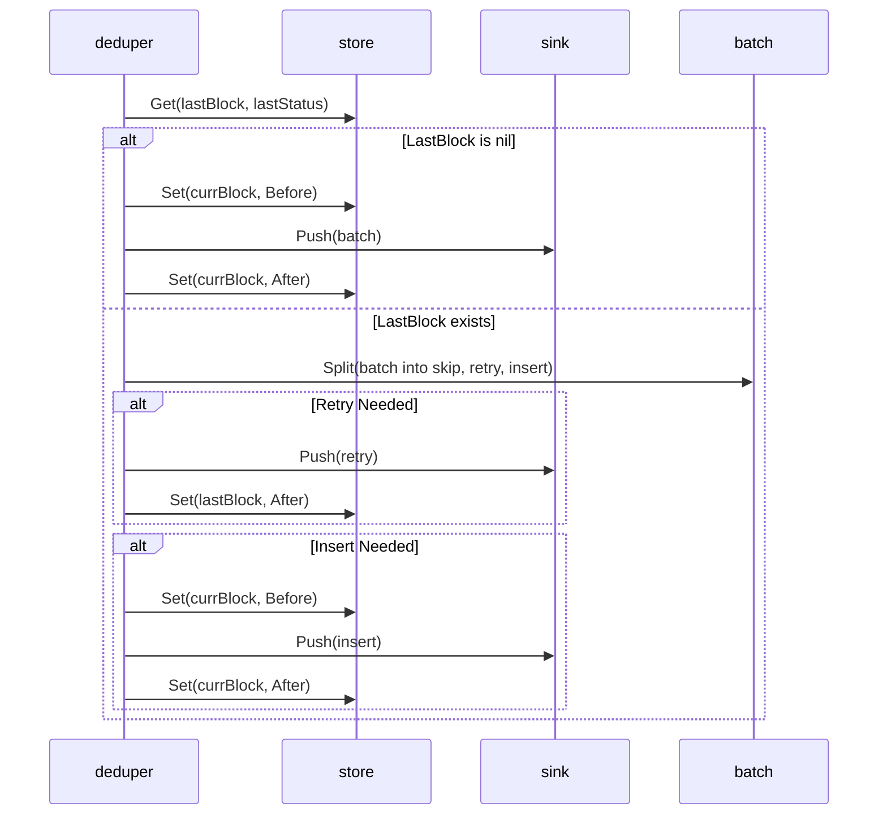
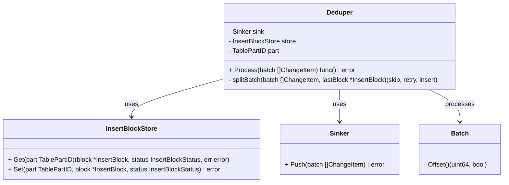
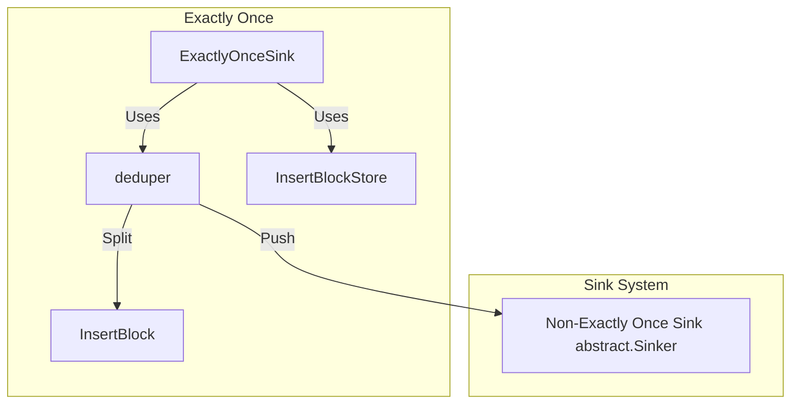
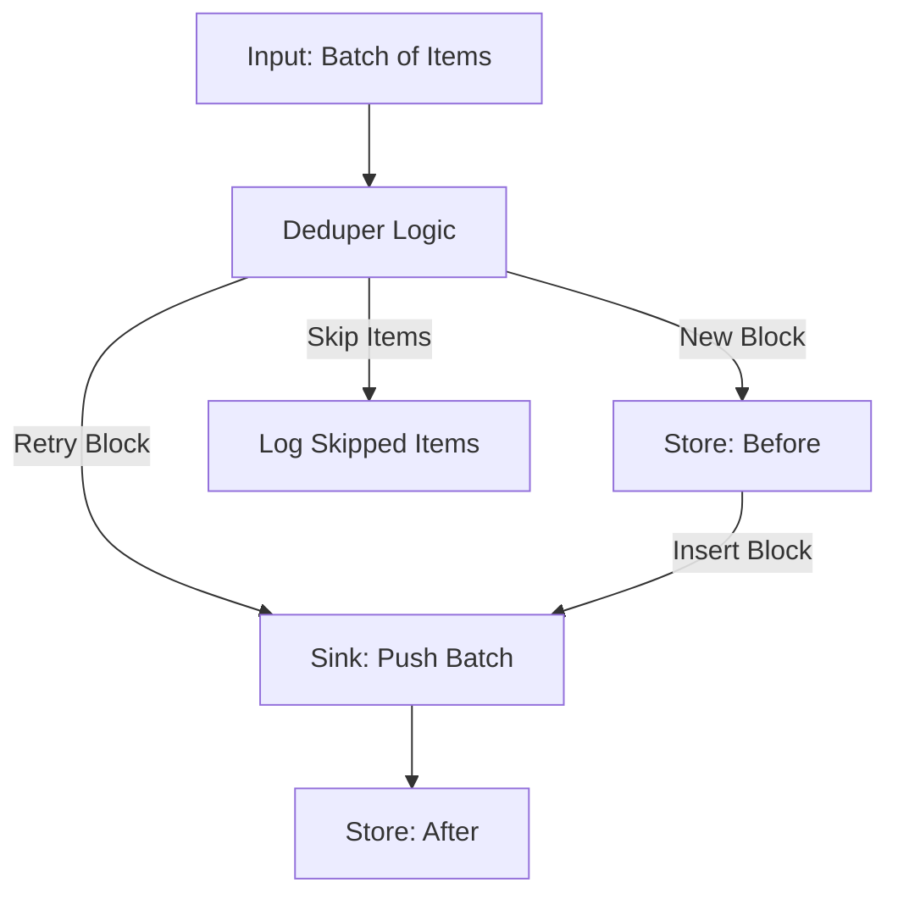
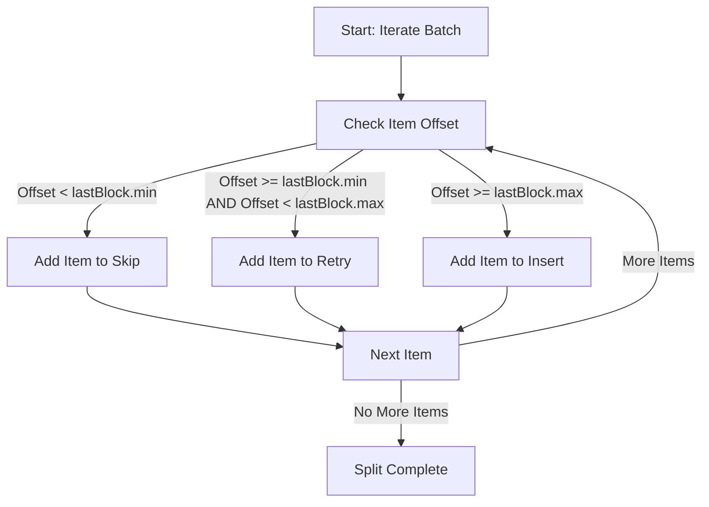

## **Exactly Once Support**

The `ExactlyOnceSink` is a wrapper layer that provides exactly-once delivery semantics for a data pipeline. This ensures that each batch of data is processed and delivered to the destination exactly once, even in the presence of retries or failures.

The core components of this implementation are:
- **Deduper**: Manages deduplication and state transitions for each data partition.
- **InsertBlockStore**: Tracks the state of processed data blocks (e.g., "before" and "after" states).
- **Sink**: Responsible for pushing the actual data to the destination.
- **Batch**: Represents incoming data to be processed.

Key assumptions to support for exactly once in Clickhouse:

- Clickhouse is replicated, i.e. contains either Zookeeper or CHKeeper. 
- `KeeperMap` table engine is enabled at target database.
- Source provide `PartID`-metadata, to split logical table into sequence of related changes
- Source provide `_offset`-column, each offset should be consistently growing.
- Source provide at-least-once delivery semantic.

The diagrams below explain the flow, structure, and interactions within the system.

---

### **1. Sequence Diagram**
**Purpose:** The sequence diagram illustrates the interaction between components (`deduper`, `store`, `sink`, and `batch`) over time. It focuses on the sequence of operations performed to achieve exactly-once semantics.

Key Highlights:
- The `deduper` retrieves the last processed block and evaluates the current batch to determine actions.
- Possible actions include skipping already processed items, retrying partially processed blocks, or inserting new data.
- State transitions in the `store` occur before and after data is pushed to the sink.

---

### **2. Class Diagram**
**Purpose:** This diagram shows the relationships and dependencies between the key components (`deduper`, `sink`, `store`, and `batch`).

Key Highlights:
- The `Deduper` is the central orchestrator, responsible for processing batches and coordinating actions.
- The `InsertBlockStore` is used to store the state of data blocks to support deduplication.
- The `Sink` is the final destination for processed data.

---

### **3. Component Diagram**
**Purpose:** The component diagram highlights the interaction between the `ExactlyOnceSink` wrapper and the existing system components.

Key Highlights:
- The `ExactlyOnceSink` manages the deduplication and state tracking for incoming batches.
- It wraps a non-exactly-once sink and uses the `deduper` and `InsertBlockStore` to ensure exactly-once delivery.
- The `deduper` performs the actual processing for each data partition.

---

### **4. Data Flow Diagram**
**Purpose:** The data flow diagram visualizes how data (e.g., batches and blocks) flows through the system and is processed.

Key Highlights:
- Data is split into different actions (skip, retry, or insert) based on its offset and the state of the last processed block.
- State transitions (`before` and `after`) are stored in the `InsertBlockStore` to track progress.

---

### **5. Decision Tree Diagram**
**Purpose:** The decision tree diagram outlines the branching logic of the `splitBatch` function, which determines how items in the batch are categorized.

Key Highlights:
- Each item in the batch is evaluated to decide whether it should be skipped, retried, or inserted.
- The decision is based on the offset of the item compared to the range of the last processed block.

---

Let me know if further refinements are needed!
