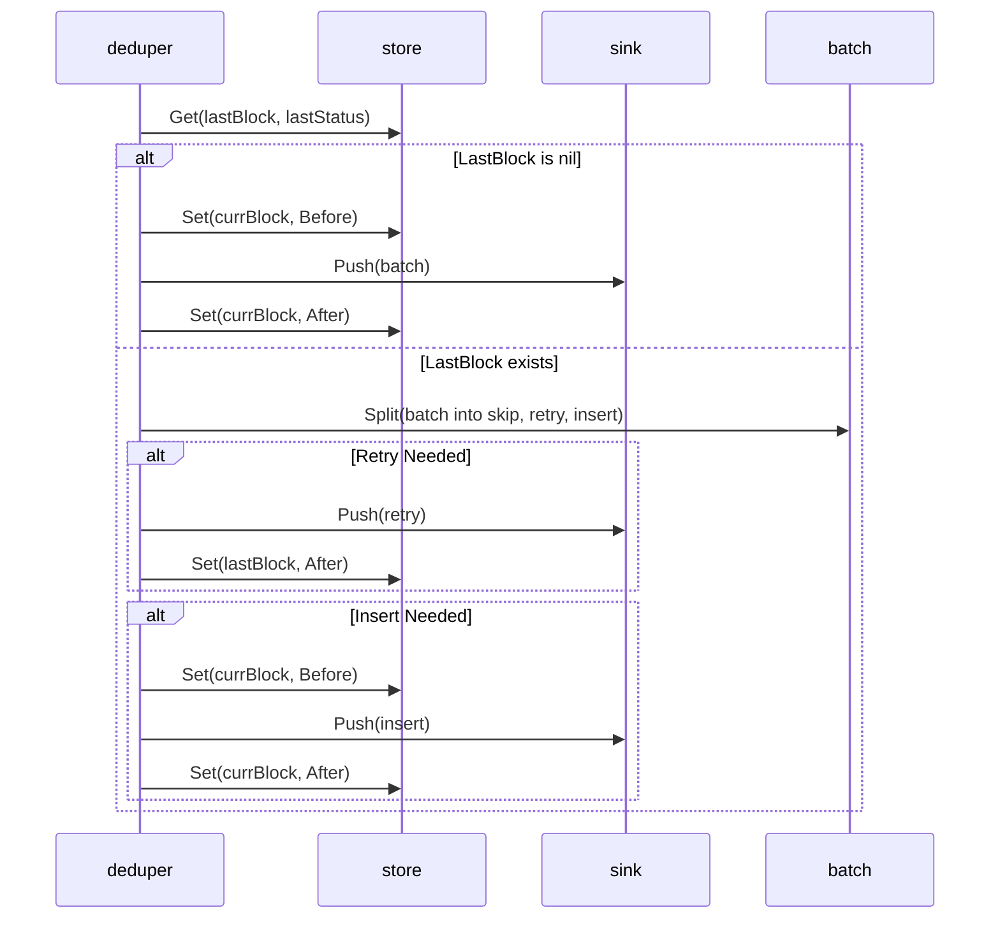
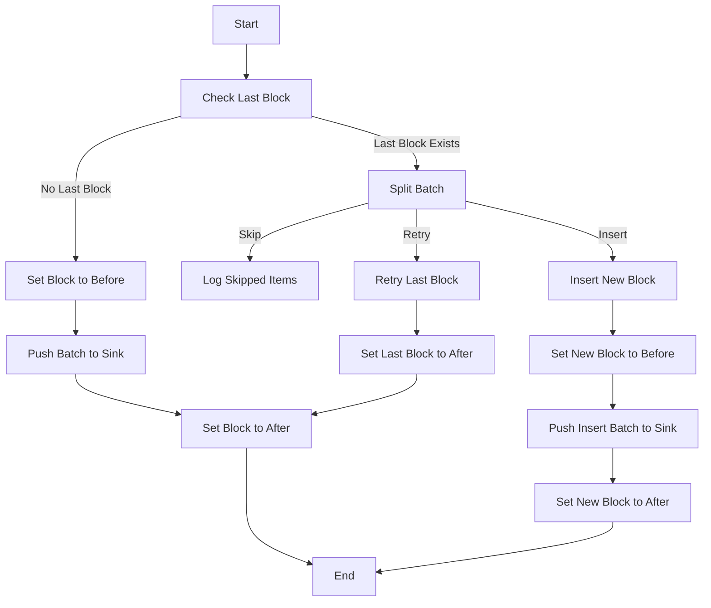
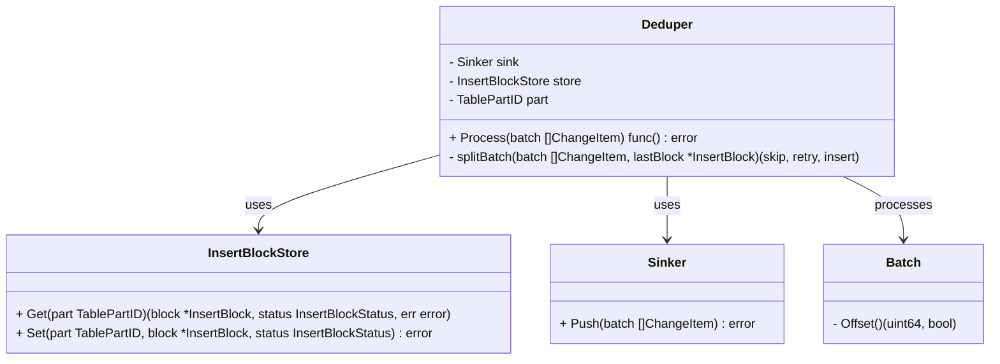
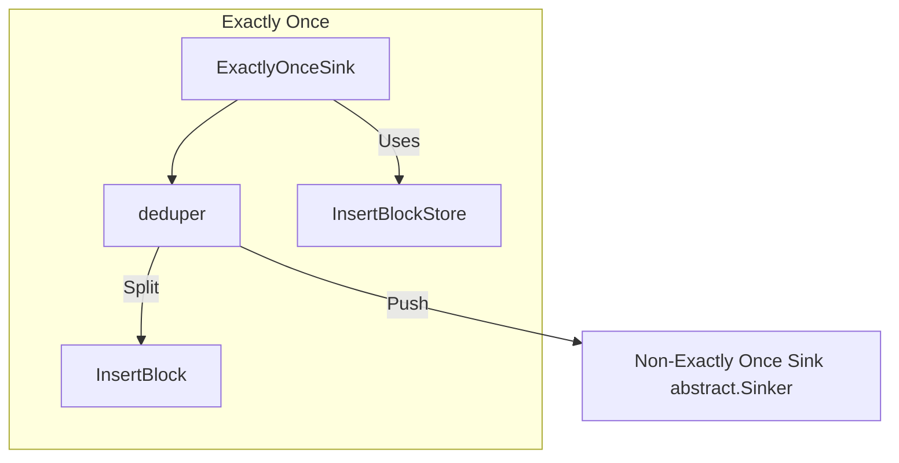
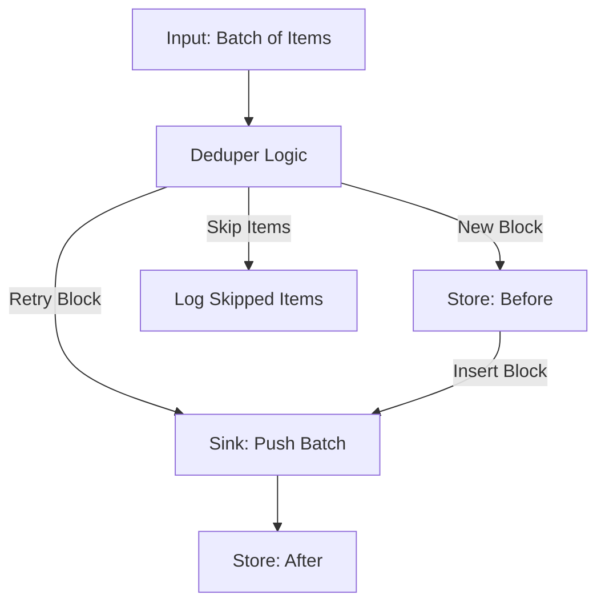
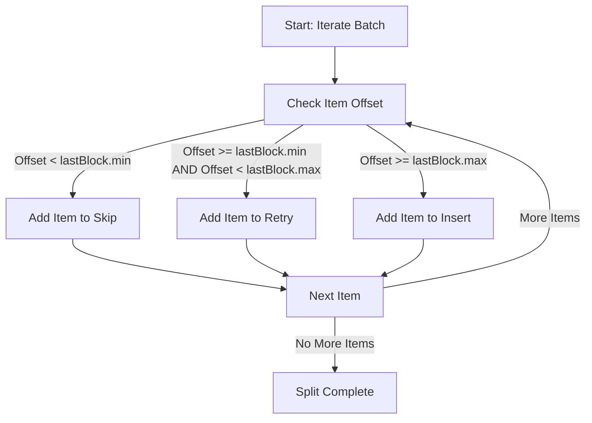

## Exactly Once Support

### **1. Sequence Diagram**

A sequence diagram illustrate the interaction between components (`deduper`, `store`, `sink`, and `batch`) over time. It focuses on the order of operations.

Key Steps to Include:
- `deduper` interacts with `store` to retrieve the last block.
- `deduper` evaluates the current `batch` and decides actions (skip, retry, insert).
- `deduper` pushes valid items to sink.
- `State` transitions (`before` → `after`) occur in `store`.

---

### **2. Activity Diagram**
An activity diagram focuses on the flow of decisions and actions in the `deduper.Process` method. It maps the logic's flow to identify branches and repetitive operations.

Here's the corrected version of the **Activity Diagram** in Mermaid syntax:

---

### **3. Component Diagram**
**Class Diagram**: diagram shows the relationships and dependencies between the key components in the system (e.g., `deduper`, `sink`, `store`, and `batch`).

**Component Diagram**: highlights the `ExactlyOnceSink` as a new component and shows how it interacts with the existing components (`sink`, `store`, and `deduper`).

---

### **4. Data Flow Diagram**
A data flow diagram shows how data (e.g., blocks and batches) moves through the system.

---

### **5. Decision Tree Diagram**
A decision tree diagram is useful for showing the branching logic in `splitBatch`.

