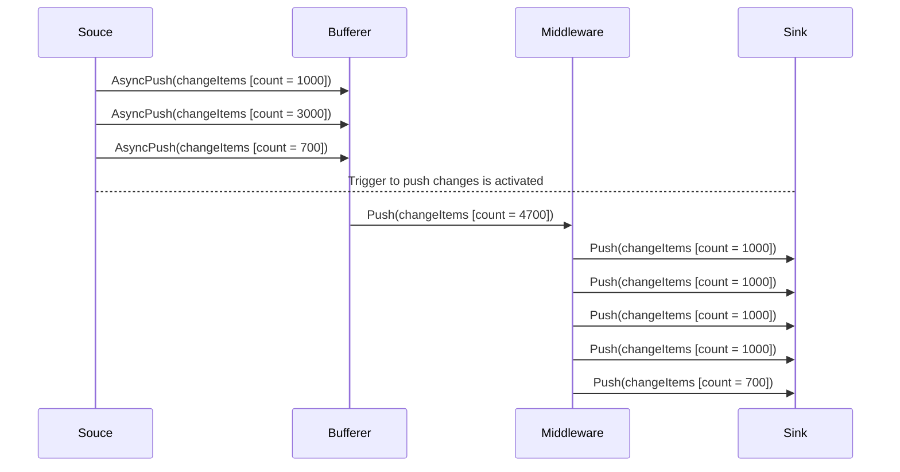

Lets imagine we use BatchSplitter middleware and set MaxItemsPerBatch to 1000. The following diagram shows how does this middleware fit into the data transfer process(and how it interacts with bufferer in particular)

